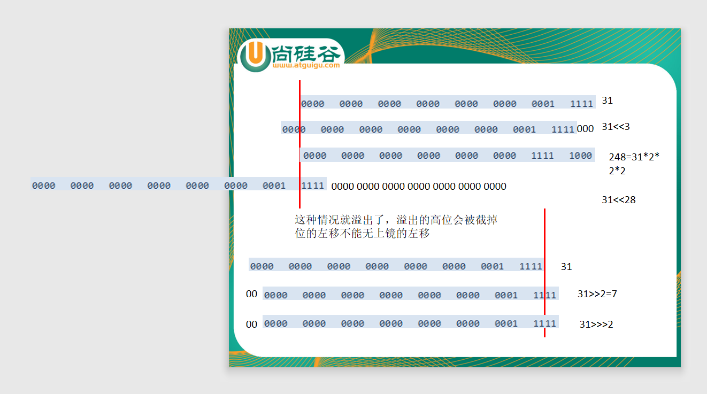
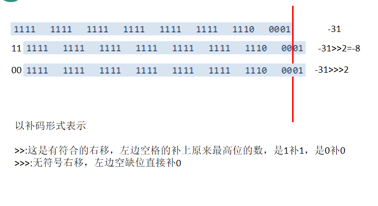
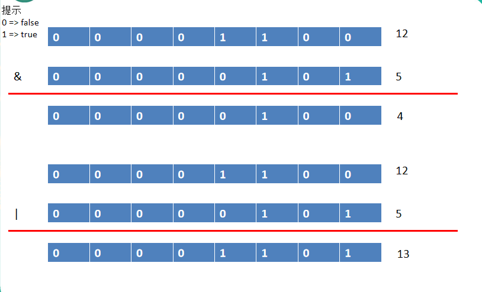
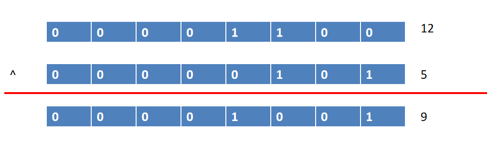
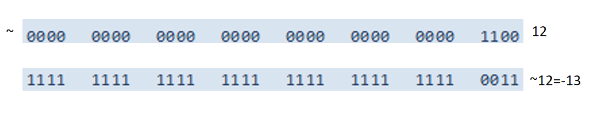
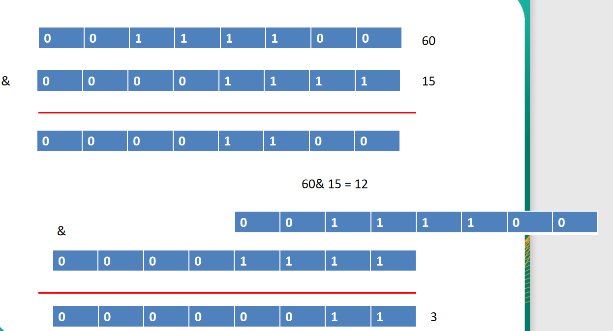

day02 基本语法
==

运算符是一种特殊的符号，用以表示数据的运算/赋值/比较

* 算术运算符
* 赋值运算符
* 比较运算符
* 逻辑运算符
* 位运算符
* 三元运算符


## 1. 算术运算符

```java
+(正)
-(负)
+
-
*
/
%
++
--
=(赋值)
+(连接)
```


### 取模%

结果符号与被模数相同

**模数的符号为负号时忽略**


### 自增

前++：先自增1，后做运算

后++：后自增1，先做运算


### 自减

前--：先自减1，后做计算

后--：后自减1，先做计算


### 注意问题

如果对负数取模，可以把模数负号忽略不记，如：5 % (-2) = 1。取模结果符号与被模数相同

对于除号"/",它的整数除和小数除是有区别的：**整数之间做除法时，只保留整数部分，直接舍去小数部分**

+既可以做加法，也可以做连接用


## 2. 赋值运算符
```JAVA
//支持连续赋值。
//同时初始化多个类型相同的变量  
char aa = 'a', bb = 'b', cc = 'c';

//同时声明多个类型相同的变量  
int x, y, z;
```

扩展赋值运算符：+=, -+, *=, /=, %=


## 3. 比较运算符
|运算符 |运算 |示例 |结果 |
|:---|:---|:---|:---|
|== |相等于|4 == 3 |false |
|!= |不等于 |4 != 3 |true |
|< |小于 |4 < 3 |false |
|\> |大于 |4 > 3 |true |
|<= |小于等于 |4 <= 3 |false |
|>= |大于等于 |4 >= 3 |true |
|instanceof |检查是否是类的对象 |"Hello" instanceof String |true |


## 4. 逻辑运算符
```java
& //逻辑与
| //逻辑或
! //逻辑非
^ //逻辑异或（表示比较的两个对象为不同值时，为真，即必须一个为真一个为假时结果才为真，否则为假，）  
  // 左右两边想异为真，否则为假    
&& //短路与
|| //短路或
```

逻辑运算符用于连接布尔型表达式，表达式的结果必须为boolean类型， 在Java中不可以写成 3<x<6，应该写成 x > 3 && x < 6

### & 和 && 的区别

+ &：左边无论true或false，右边都进行运算
+ &&：如果左边为false，右边不再运算；如果左边为true，右边才参与运算，这种情况下就提高了效率。可以把&&当作是&的智能版， 推荐使用 &&

### | 和 || 的区别

+ |：左边无论true还是false，右边都会进行运算
+ ||：当左边为true，右边不进行运算，这也是算是一种提高效率的方法；左边为false时，右边参与运算。||相当于|的智能版, 推荐使用 ||

**^：追求的是"异"，比较的两边结果不同时为真，相同则为假**

```java
true ^ true   //结果为false
false ^ false //结果为false
true ^ false  //结果为true
false ^ true  //结果为true
```

|值/项 |a |b |a & b |a &#124; b |!a |a ^ b |a && b |a &#124;&#124; b |
|:--- |:--- |:--- |:--- |:--- |:--- |:--- |:--- |:--- |
| |**true** |**true** |true |true |false |false |true |true |
| |**true** |**false** |false |true |false |true |false |true |
| |**false** |**true** |false |true |true |true |false |true |
| |**false** |**false** |false |false |true |false |false |false |


## 5. 位运算符

位运算是直接对二进制进行运算, 以补码形式表示


运算符 |运算 |示例 |备注
:--- |:--- |:--- |:---
<< |位左移 |3 << 2 = 12 --> 3\*2*2 = 12 |左移2位，相当于乘以2<sup>2</sup>
\>> |位右移 |31 >> 2 = 7 --> 31/2 = 15, <br />15/2 = 7 |右移2位，相当于除以2<sup>2</sup>，取商，舍去余数<br>左边空格的补上原来最高位的数，是1补1，是0补0 <br>正数的最高位为0，负数的最高位为1 <br>原来是正数移位运算后仍是正数，原来是负数的则仍是负数
\>>> |位无符号右移 |3 >>> 1 = 1 |左边空缺位直接补0  <br>负数移位运算后变成正数，正数则仍是正数
& |位与运算 |6 & 3 = 2 | 
&#124; |位或运算 |6 &#124; 3 = 7 | 
^ |位异或运算 |6 ^ 3 = 2 | 
~ |反码 |~6 = -7 |按二进制补码位取反（包括符号位），<br/>正数取反(得负数)，各二进制码按补码各位取反;<br/>负数取反(得正数)，各二进制码按补码各位取反 <br/>注意正数原码, 反码, 补码、都相同, 负数的补码为源码的反码然后加1

### 左移, 右移




### 无符号右移

 

### 位与, 位或




### 位异或



### 反码



### 交换

 m = (m ^ n) ^ n = m

```JAVA
// 方法3：用位的异或运算
// 无上面两种方法的缺点
// m = (m ^ n) ^ n 
m = m ^ n;
n = m ^ n; // ==>  (m ^ n) ^ n == m
m = m ^ n; // ==> (m ^ n) ^ m == n
```


## 6. 三元运算符
```java
//条件表达式 ? 表达式1 : 表达式2             或 (条件表达式) ? 表达式1 : 表达式2
//条件表达式为true，则三元运算结果为表达式1
//条件表达式为false，则三元运算结果为表达式2

//如：
int a = 10, b = 20;
max = a > b ? a : b
```
表达式1 和 表达式2 为同种数据类型，三元运算的结果与表达式1/表达式2的数据类型相同

三元运算与if-else的联系与区别

* 三元运算可简化为if-else语句,反之则不成立
* **三元运算要求必须返回一个结果**  
* if后的代码块可以有多个语句


## 7. 运算符的优先级
* 运算符优先级就是表达式中的运算顺序，如下图，上一行运算符总优先于下一行。
* 只有单目运算符、三元运算符、赋值运算符是从右向左运算的
* 建议不要在同一个表达式中写太多的运算符

<table>
    <tr>
        <td></td>
        <td>. () ; ,</td>
        <td rowspan="16">高<br><br><br><br>低</td>
    </tr>
    <tr>
        <td>R -> L</td>
        <td>++ -- ~ !(data type)</td>
    </tr>
    <tr>
        <td>L -> R</td>
        <td>* / %</td>
    </tr>
    <tr>
        <td>L -> R</td>
        <td>+ -</td>
    </tr>
    <tr>
        <td>L -> R</td>
        <td><< >> >>></td>
    </tr>
    <tr>
        <td>L -> R</td>
        <td>< > <= >= instanceof</td>
    </tr>
    <tr>
        <td>L -> R</td>
        <td>== !=</td>
    </tr>
    <tr>
        <td>L -> R</td>
        <td>&</td>
    </tr>
    <tr>
        <td>L -> R</td>
        <td>^</td>
    </tr>
    <tr>
        <td>L -> R</td>
        <td>|</td>
    </tr>
    <tr>
        <td>L -> R</td>
        <td>&&</td>
    </tr>
    <tr>
        <td>L -> R</td>
        <td>||</td>
    </tr>
    <tr>
        <td>R -> L</td>
        <td>? :</td>
    </tr>
    <tr>
        <td>R -> L</td>
        <td>= *= /= %=</td>
    </tr>
    <tr>
        <td></td>
        <td>+= -= <<= >>=</td>
    </tr>
    <tr>
        <td></td>
        <td>>>> = &= ^= |=</td>
    </tr>


## 8. 10进制转16进制

```JAVA
int x = i & 15; // 为什么是与15做与运算，因为4位二进制数每位数都为1的数转10进制值为15。这一步的主要目的是取出i的最后4位数2进制值
String v1 = (x <= 9) ? x + "": (char)( x - 10 + 'a') + ""; // 判断是否小于=9

i = i >> 4; // 把i右移的位，相当于，把上面这步的后面4位截掉了
int y = i & 15;
String v2 = (y <= 9) ? y + "" : (char)(y - 10 + 'a') + "";
```

+ 直接和15进行与运算
+ 去掉已经运算过的最右四位，然后反复

