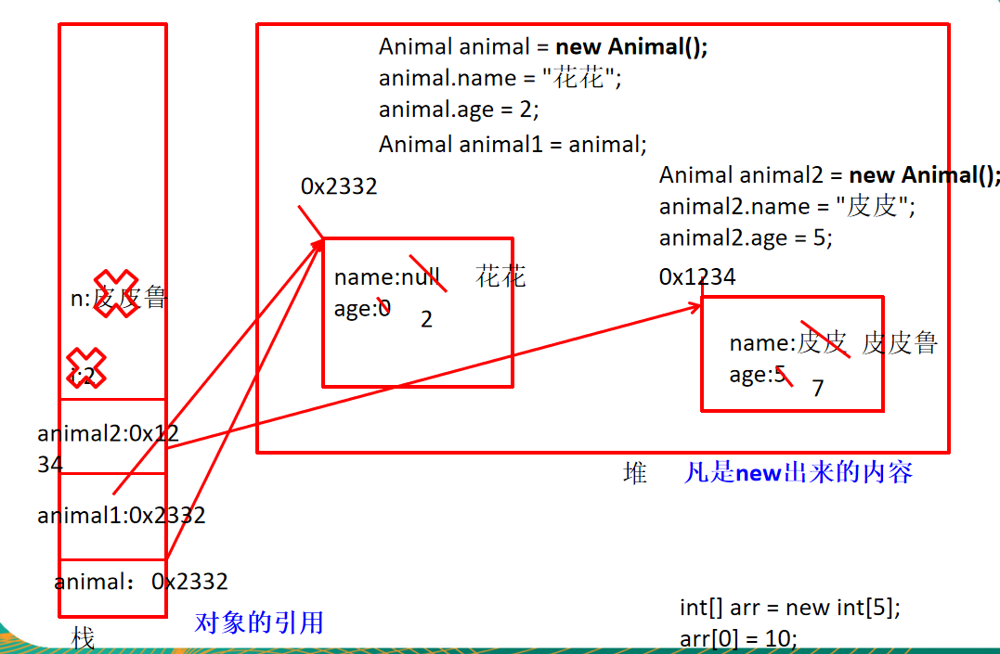
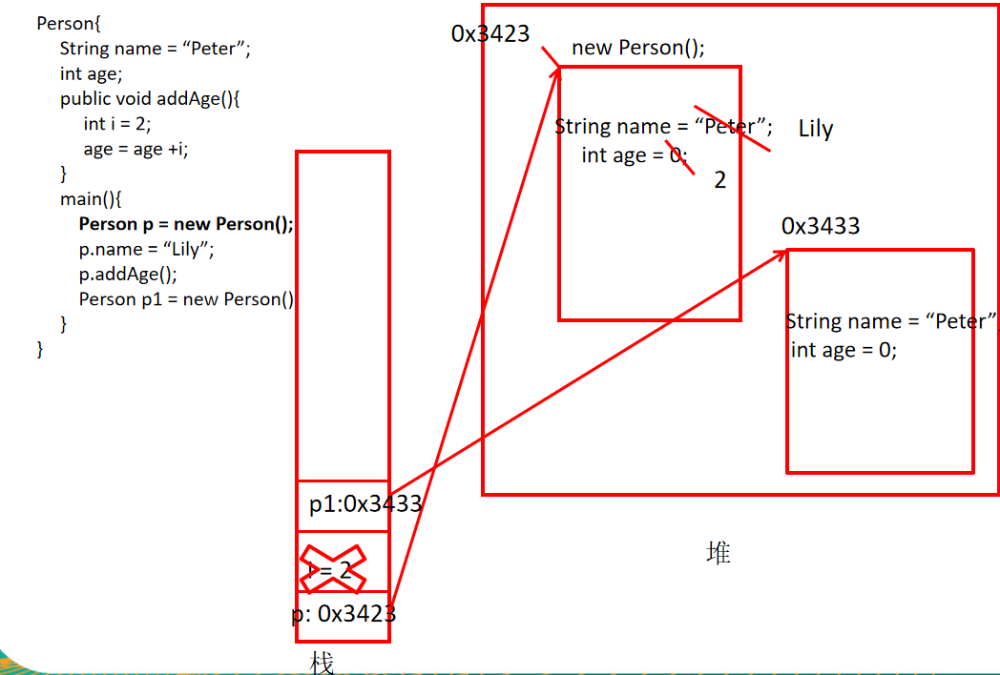
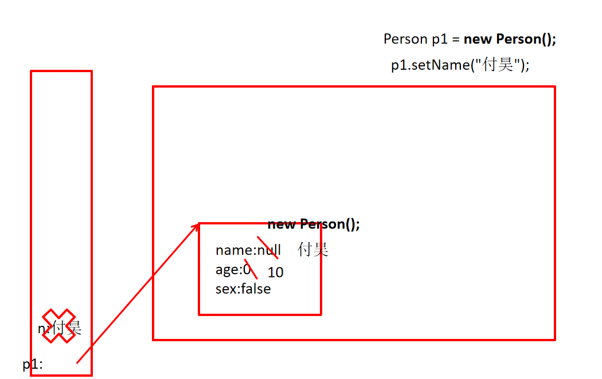

day05 面向对象编程
==

java类及类的成员

面向对象的三大特征： **封装、继承、多态、抽象**


## 1. 面向对象vs面向过程  
面向过程，强调的是功能行为。

面向对象，将功能封装进对象，强调具备了功能的对象。三大特征  

+ 封装(Encapsulation)  
+ 继承(Inheritance)  
+ 多态(Polymorphism)  


## 2. 面向对象的思想

程序员从执行者转化成了指挥者, **“万事万物皆对象”**

完成需求时

+ 先去找具有所需功能的对象来用
+ 如果该对象不存在，那么创建一个具有所需功能的对象
+ 简化开发，提高复用

类和对象是面向对象的核心概念

+ 类是对一类事物的描述，是抽象的、概念上的定义
+ 对象是实际存在的该类事物的每个个体，因而也称实例(instance)


## 3. class类结构

* Field = 属性 = 成员变量,
* Method = [成员]方法 = 函数

```java
public class Person {
    // 属性(成员变量)
    String name;
    boolean isMale;
    
    //构造器
    public Person() {}
    public Person(String n, boolean ism) {
        name = n;
        isMale = ism;
    }
    
    // 方法(函数)
    public void walk() {
        System.out.println("人两腿走路...");
    }
    
    public String showInfo() {
       String info = "名字是:" + name + " 年龄是:" + age + " sex:" + isMale;
       return info;
    }
    
    // 代码块
    {
        name = "Lu meng";
        age = 17;
        isMale = true;
    }
    
    // 内部类
    class pet {
        String name;
        float weight;
    }
}
```


## 4. 创建自定义类
### 属性
修饰符 类型 属性名 = 初始值

```java
public class Person {
    private int age;
    public String name = "Lilei";
}
```


### 变量分类

#### 成员变量

在方法外，类体内的变量

+ 实例变量（不以static 修饰）
+ 类变量（以static修饰）  

#### 局部变量

 在方法体内声明的变量 方法中的形参

+ 形参（方法签名中定义的变量）
+ 方法局部变量（在方法内定义）
+ 代码块局部变量（在代码块内定义）


#### 成员变量vs局部变量
**成员变量**

+ **成员变量定义在类中，方法外**，在整个类中都可以访问
+ 成员变量分为 **类成员变量** 和 **实例成员变量**。 实例变量存在于对象所在的堆内存  
+ 成员变量有默认初始值

**局部变量**

+ 局部变量只定义在局部范围内，如：方法内，代码块内，形参  
+ 局部变量存在于栈内存中  
+ 作用的范围结束，变量空间会自动释放  
+ 局部变量没有默认初始值，每次都必须显示初始化  
+ 局部变量声明时不指定权限修饰符


### 成员变量的默认值

类型 |默认值 |打印效果 
:---| :--- |:--- 
byte |0 |0 
short |0 |0 
int |0 |0 
long |0L |0 
float | 0.0F |0.0 
double |0.0 |0.0 
boolean | false |false 
char | 空白 |不打印任何内容 
String |null |null 
引用数据类型 |null |null 


### 对象的创建和使用

+ 使用 new 构造器 创建一个新的对象  
+ 使用 对象名.对象成员 的方法访问对象成员


```java
public class Animal {
    public int legs;
    public void eat() {
        System.out.println("Eating ...");
    }
    
    public void move() {
        System.out.println("Moving ...");
    }
}

public class Zoo {
    public static void main(String[] args){
      Animal xb = new Animal();
      xb.legs = 4;
      System.out.println(xb.legs);
      xb.eat();
      xb.move();
    }   
}
```









### 访问机制
#### 同类中的访问机制

类中的方法可以直接访问类中的成员变量  

+ 对象方法可以访问类方法
+ **类方法不能访问对象方法**

#### 不同类的访问机制

先要创建要访问类的对象，在用对象访问类中定义的成员


### 方法

方法是类或对象行为特征的抽象，也成为函数。java里的方法不能独立存在，所有的方法必须定义在类里

**方法签名：方法名和参数（不包括返回值）**

* 形参
    在方法被调用时用于接受外部传入数据的变量
+ 参数类型
    就是该形参的数据类型
+ 返回值
    方法在执行完毕后返还给调用它的程序的数据
+ 返回值类型
    方法要返回结果的数据类型
+ 实参
    **调用方法时实际传给函数形式参数的数据**
+ 返回值类型void
    即返回的就空，void类型的方法，**可以在方法最后写 return;** 这也表示不返回任何东西

```java
修饰符 返回值类型 方法名(参数类型 形参1, 参数类型 形参2, ...) {
    程序代码;
    return 返回值;        
}
```


#### 方法的调用

方法只有被调用才会被执行

没有具体返回值得情况，返回值类型用void表示，且该方法的return在最后一行时可以省略不写

定义方法时，方法的结果应该返回给调用者，交由调用者处理

**方法中只能调用方法，不可以在方法内部定义方法**


#### 方法的重载

在同一个类中，允许存在一个以上的**同名方法**， 只要**参数个数不同或者参数类型不同**即可

构成重载**的方法对外只暴露一个接口，通过传不同的参数来自动选择不同的处理方法**（提供不同的处理功能）。  

**于返回值类型无关，只看参数列表。 参数列表必须不同**。调用时根据参数列表的不同类区别


#### 可变形参

采用数组形参定义方法

```java
public static void test(int a, String[] books) {    }
```
可变个数形参定义方法

```java
public void test(int a, String... books) {}
```
+ 可变参数：方法参数个数可变  
+ 声明方式：方法名(参数类型... 参数名) 
+ 可变参数方法的使用与数组参数是一致的  
+ **方法的参数部分有可变参数时，必须放在形参中的最后一个**， 个数可以是0个或多个


## 6. 内存划分的结构
栈(stack): 局部变量，对象的引用名，数组的引用名

堆(heap): new 出来的对象实例，（对象实体，数组的实体），成员变量

方法区: 含字符串变量

静态域: 声明为static的变量


## 7. 方法的参数传递

### 形参 - Formal Parameter

方法声明时的参数

### 实参 - Actual Parameter

方法调用时实际传给形参的参数值。 **java方法里的参数传递方式只有一种：值传递**， 即将实际参数值得副本传入方法内，而参数本身不受影响  

+ **形参是基本数据类型**：将**实参的值传递**给形参的基本数据类型的变量 
+ **形参是引用数据类型**：将**实参的引用类型变量的值**（对应的堆空间的对象实体的内存首地址）传递给形参的引用类型变量

```java
package com.java.www;

public class Test {
    public static void main(String[] args) {
        Test t = new Test();
        t.first();
    }

    public void first() {
        int i = 5;
        Value v = new Value();
        v.i = 25;
        second(v, i);
        System.out.println(v.i);
    }

    public void second(Value v, int i) {
        i = 0;
        v.i = 20;
        Value val = new Value();
        v = val;
        System.out.println(v.i + " " + i);
    }

}

class Value {
    int i = 15;
}
```


## 8. 面向对象特征1：封装

* **隐藏一个类中不需要对外提供实现的细节**
* **使用者只能通过事先定制好的方法来访问数据**，可以方便地加入控制逻辑，限制对属性的不合理操作
* 便于修改，**增强代码的可维护性**

使用者对类内部的属性(对象的成员变量)直接操作会导致数据的错误、混乱或安全性问题

将数据声明为私有的(private)，再提供公共的(public)方法实现对该属性的操作，以实现下面的目的
 ```java
public class EncapsulationAndHiding {
    public static void main(String[] args) {
        Animal dog1 = new Animal();
        dog1.setLegs(4);
        dog1.setLegs(-100); // 不合法的数字
        System.out.println(dog1.getLegs());
    }
}

class Animal {
    private int legs;
    public void setLegs(int i) {
        if (i < 0 || i > 100) {
            System.out.println("输入的数字不合法");
        } else {
            legs = i;
        }
    }

    public int getLegs() {
        return legs;
    }
}
 ```
