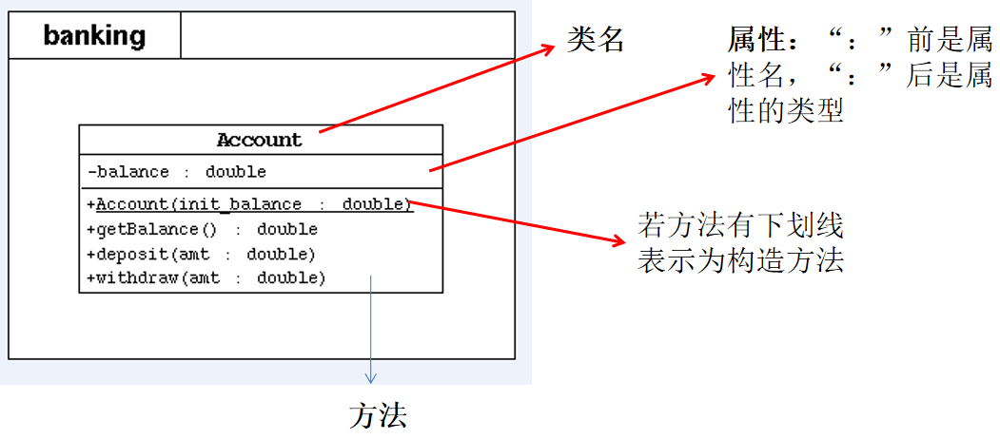
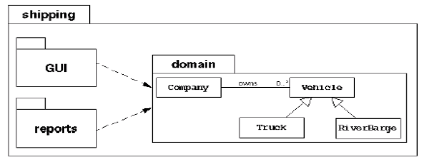
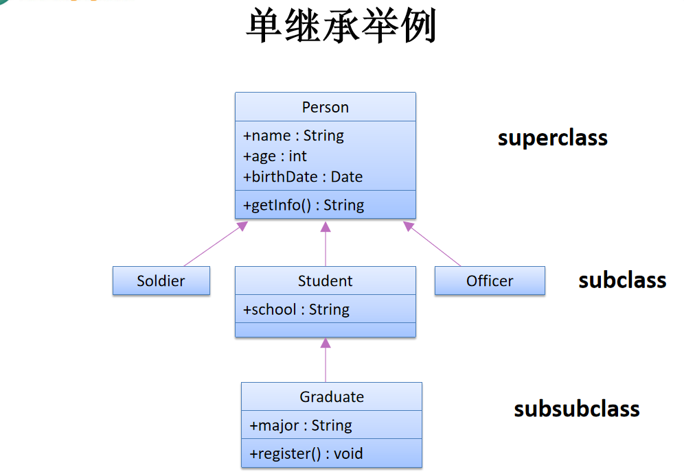

day07 高级特性
==


## 1. this

### 概述
在java中，this的作用和其词义相近。
* 在方法内部使用，**即这个方法所属对象的引用**
* 在构造器内部使用，**表示该构造器正在初始化的对象**

this表示当前对象，可以调用类的属性， 方法和构造器。当在方法内需要调用该方法的对象时，就用this

**使用this调用属性， 方法， this理解为当前对象或当前正在创建的对象**

```java
class Person {
    private String name;
    private int age;
    
    // 构造器
    public Person(String name, int age) {
        this.name = name;
        this.age = age;
    }
    
    // 方法
    public void getInfo() {
        System.out.println("姓名: " + name);
        this.speak();
    }
    
    public void speak() {
        System.out.println("年龄: " + this.age);
    }
}
```

**使用this调用本类的构造器**

```java
class Person {
    private String name;
    private int age;
    
    // 构造器
    public Person() { // 构造器1，无参构造器
        System.out.println("新对象实例化");
    }
    
    public Person(String name) { // 构造器2
        this(); // 调用本类中的构造器1（无参构造器）
        this.name = name;
    }
    
    public Person(String name, int age) {
        this(name); // 调用 构造器2
        this.age = age;
    }
    
    // 方法
    public String getInfo() {
        return "姓名: " + this.name + ", 年龄: " + age;
    }
}
```

**this可表示正在操作本方法的对象，即当前对象**

```java
class Person {
    String name;
    
    // 构造器
    Person(String name) {
        this.name = name;
    }
    
   // 方法
   public void getInfo() {
        System.out.println("Person类==>" + this.name);
   }
   
   public boolean compare(Person p) {
        return this.name = p.name;
   }
}
```

### 注意事项
* **构造器中，使用this(形参)必须放在构造器的首行**
* 使用this调用本类中其他的构造器，保证至少有一个构造器不是使用this，避免形成死循环


## 2. JavaBean

JavaBean是一种java语言写成的可重用组件，所谓JavaBean，是指符合如下标准的java类

* 类是公共的(public)
* 有一个无参的公共构造器
* 有属性，且有对应的get, set方法

```java
public class TestJavaBean { // 类访问权限为public
    private String name; // 属性 权限修饰符一般为private
    private int age;
    
    // 无参public构造器
    public TestJavaBean() {
        
    }
    
    // 方法(get、set方法)
    public void setName(String name) {
        this.name = name;
    }
    
    public String getName() {
        return name;
    }
    
    public void setAge(int age) {
        this.age = age;
    }
    
    public int getAge() {
        return age;
    }
    
}
```


## 3. UML图表示类方法



权限表示
* \+ 表示public
* \- 表示private
* \# 表示 protected

方法的写法

>方法类型(+、-) 方法名(参数名: 参数类型): 返回值类型


## 3. 关键字-package

### 作用

包帮助管理大型软件系统：将主义相近的类组织到包中；解决类命名冲突问题

包可以包含类和子包

例：某航运软件系统包括：一组域对象、GUI和reports子系统


### 使用
package语句作为java源文件的**第一个语句，指明该文件中定义的类所在的包。**

包对应文件系统的目录，package语句中，用"."来指明包(目录)的层次

包通常用小写单词，类名首字母通常大写

```java
// pack/Test.java
package pack; // 指定类Test属于包pack

public class Test {
    public void display() {
        System.out.println("in method display()");
    }
}

```


## 4. 关键字-import
### 作用

import语句告诉编译器到哪里去寻找类，为使用定义在不同包的java类，需要import语句来引入指定包层次下所需要的类或全部类(.*)

```java
import pack.Test; // import pack.*; 表示引入pack包中所有的类
public class TestPackage {
    public static void main(String[] args){
        Test t = new Test();
        t.display();
    }
}
```


### 注意事项
若引入的包为:**java.lang,则编译器默认可获取此包下的类**，不需要再显式声明。

import语句出现在package语句之后， 一个源文件可包含多个import语句

**可以使用import lee.*;语句，表明导入lee包下的所有类，而lee包下sub子包内的类则不会被 导入。若要导入sub下的类:import lee.sub.*;**

import 语句还是必须的，可在类里使用类的命名。如java.util.Scanner

JDK 1.5加入import static语句


## 5. JDK主要的包介绍

+ java.lang

>包含一些java语言的核心类，如String、Math、Integer、System、Thread，常用功能
* java.net
>包含执行与网络相关操作的类和接口
* java.io
>包括能提供多种输入/输出功能的类
* java.util
>包含一些实用工具类，如定义系统特性、接口的集合框架类、与日期日历相关的函数
* java.text
>包含了一些java格式化相关的类
* java.sql
>包含了java进行JDBC数据库编程相关的类/接口
* java.awt
>包含了构成抽象窗口工具集(abstract windows toolkits)的类，这些类被用来构建和管理
应用程序的图形用户界面(GUI)
* java.applet
>包含applet运行所需的类


## 6. 面向对象特征之二：继承

### 基本概念
多个类中存在相同属性和行为时，将这些内容抽取到单独的一个类中，那么其他多个类就不需要再定义这些属性和行为，只要继承那个类即可

此处的多个类成为"子类"，单独的这个类称为"父类"

```JAVA
class Subclass extends Superclass { }  
```


### 作用

* 继承提高了代码的复用性
* 继承让类于类之间产生了关系，提供了多态的前提


### 注意事项

* 不要仅为了获取其他类中某个 功能而去继承
* 子类继承了父类的方法和属性(**两者都包括priavte的，只是不能直接调用**)。
* 在子类中，可以使用父类中定义的方法和属性，也可以创建新的属性和方法
* java中，继承的关键字是"extends"，子类不是父类的子集，而是父类的扩展


### 规则

* **子类不能直接访问父类中私有的(private修饰)的属性和方法**
* java继承只支持单继承（即一次只能继承一个父类），不允许多重继承，但允许多层继承
    * 一个子类只能有一个父类
    * 一根父类可以派生出多个子类
* 类的构造器不能被继承，因为构造器名要与类名相同
* **当父类定义了public 构造器时，必须在子类中重新定义构造器，不再提供默认的构造器了。**当父类的构造器为缺省的权限修饰符或没写，则子类中依然有默认的构造器


## 7. 重写

在子类中可以根据需要对从父类继承来的方法进行重新写过，也称方法的覆盖、重置。在程序执行时，子类的方法将覆盖父类的方法

### 规则
注意的要素： 修饰符 返回值类型 方法名(参数列表) { }
* 子类重写方法必须和父类**被重写方法具有相同的 方法名、参数列表、返回值类型。**

* 子类重写**方法修饰符权限不能比父类被重写方法访问权限小，可以更大，至少也要相等**(可以理解为继承的开放性)

* 子类重写和父类被重写的**方法必须同时为static的或同时为非static的类型**

* 子类重写方法**抛出的异常类型不能大于父类被重写方法的异常类型**

* **private方法不能重写。**如果父类中一个方法 private myMethod() { },子类中写了一个 myMethod() { } 或public myMethod() { }，那么这两种情况都不叫重写。因为父类的方法在子类中不见。

* **如果声明类型是父类，实际类型是子类，那么子类的属性不会覆盖父类属性**

  ```java
   // 父类
   private myMethod() { }
   
   // 子类
   public myMethod() { }
  
  public class Person {
      public String a = "a";
  }
  
  public class Student2 extends Person {
      public String a = "b";
  }
  
  Person s2 = new Student2();
  System.out.println("s2's a: " + s2.a); //output is a
  ```




## 8. 重写与重载的区别
### 重载

  * 同一个类
  * 同一个方法名
  * 不同的参数列表
  * **方法的重载与方法返回值无关**
  * 构造器可以重载

### 重写

* 前提在继承的基础之上，子类在获取父类的结构之后，可以对父类中同名的方法进行“重构”
* **方法的返回值、方法名、形参列表相同**
* 权限修饰符不小于父类同名方法
* 重写的方法异常类型不大于父类的
* 两个方法要同为static或非static


