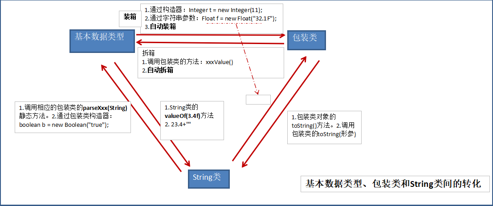
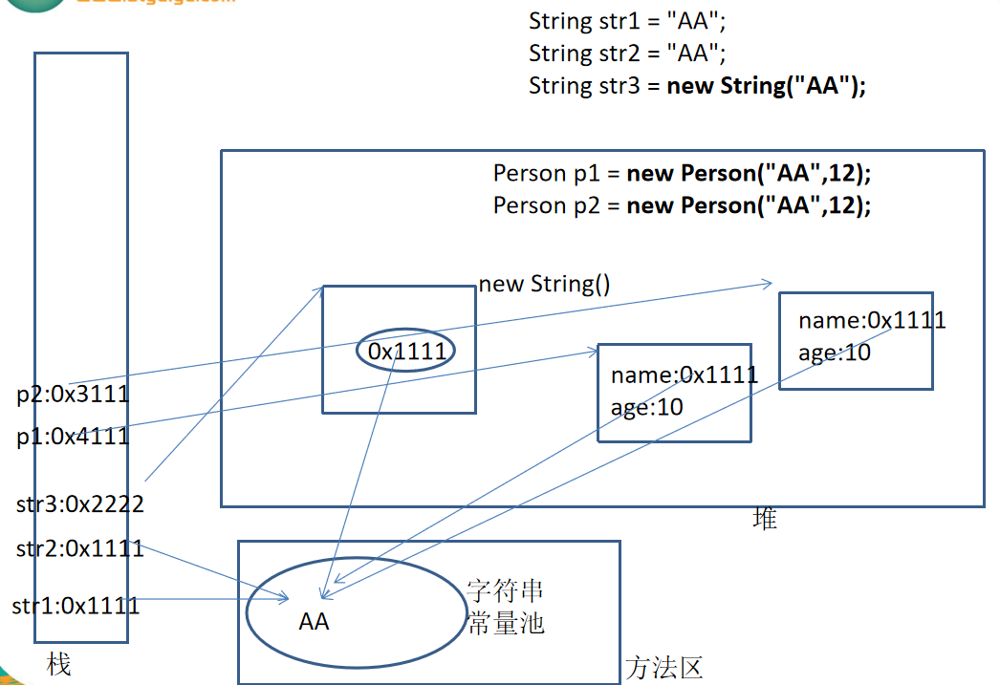

day09 高级特性
==


## 1. toString()方法

toString()方法在Object类中定义，其返回值是String类型，**返回类名和它的引用地址**。在进行String与其他类型数据的连接操作时，自动调用toString()方法

```java
Date now = new Date();
System.out.println("now = " + now);
System.out.println("now = " + now.toString()); 
```
可以根据需要在用户自定义的类中重写toString()方法

```java
// 如String类重写了toString()方法，返回字符串的值
s1 = "hello";
System.out.println(s1); // 相当于System.out.println(s1.toString());
```
基本数据类型转换为String类型时，调用了对应包装类的toString()方法。**String, 包装类, File, Date等类默认就已经重写了toString()方法**


​    
## 2. 包装类
针对8种基本定义相应的引用类型

基本数据类型 |包装类 
:--- |--- 
boolean |Boolean 
byte |Byte 
short |Short 
int |Integer 
long |Long 
char |Character
float |Float 
double |Double 

### 装箱

基本数据类型包装成包装类，叫做 装箱

*  通过包装类的构造器实现
```java
int i = 500;
Integer t = new Integer(i);
````
* 通过字符串参数构造器包装类对象
```java
Float f = new Float("4.56");
Float f2 = new Float(3.14);
Long l = new Long("abc") // 编译时报NumberFormatException
  
Boolean b1 = new Boolean("true"); // true
System.out.println(b1);
Boolean b2 = new Boolean(false);
System.out.println(b2);
Boolean b3 = new Boolean("true100"); // false，只要写的不是true，则都是false,能正常编译和运行
System.out.println(b3);
```

### 拆箱

获得包装类对象中包装的基本类型变量，叫做拆箱

+ 调用包装类对象的.xxValue()方法

```java
Boolean obj = new Boolean(true);
boolean b = obj.booleanValue();
```

+ JDK 1.5之后，支持自动装箱，自动拆箱。但类型必须匹配

```java
// JDK 1.5后，自动装箱、拆箱
int i61 = 18;
Integer i62 = i61; // 自动装箱
System.out.println(i62.toString());
Boolean b63 = false;

Integer i66 = new Integer(15);
int i67 = i66; // 自动拆箱
System.out.println(i66);
```

### 字符串转换成基本数据类型

```java
//通过包装类的构造器实现
int i = new Integer("12");

// 通过包装类的parseXx(String s)静态方法
Float f = Float.parseFloat("12.1");
```
### 基本数据类型转换成字符串

```java
//调用String类重载的valueOf()方法
String ftr = String.valueOf(2.34F);

// 字符串拼接的方式
String intString = 5 + "";
```


### 基本数据类型, 包装类, String类三者之间的互转



String相关的变量在内存的结构  



## 3. static关键字

当我们编写一个类时，其实就是在描述其对象的属性和行为，而并没有产生实质上的对象，只有通过new关键字才会产生出对象，这时系统才会分配内存空间给对象，其方法才可以供外部调用。有时候希望无论是否产生了对象或无论产生了多少对象的情况下，某些特定的数据在内存空间里只有一份，例如所有的中国人都有个国家名称

**static可以修饰 属性、方法、代码块、内部类**

### static修饰的属性

* 有该类创建的所有对象，都共用这个变量
* 当其中一个对象修改了此属性，其他属性访问到该属性的结果也会改变。
* 类变量在类加载时加载到内存，且只有一份数据
* 静态的变量（类变量）访问方法之一："类.类变量" 
* 类变量访问方法二："对象.类变量"
* 类变量的加载早于对象
* 访问权限允许时，可以不创建对象，直接被调用

### static修饰的方法

* 类方法在类在加载时一起加载
* 可以通过"类.类方法" 调用，也可以"对象.类方法"，建议使用第一种
* 静态方法可以可以调用静态属性和静态方法，**但不能调用非静态的属性和非静态的方法**
* **重载**的方法需要同时为static或者非static
* **静态的结构(static的属性、方法、代码块、内部类)的生命周期要早于非静态的结构，被回收的时间要晚于非静态的结构静态方法**里不能有this、super关键字
