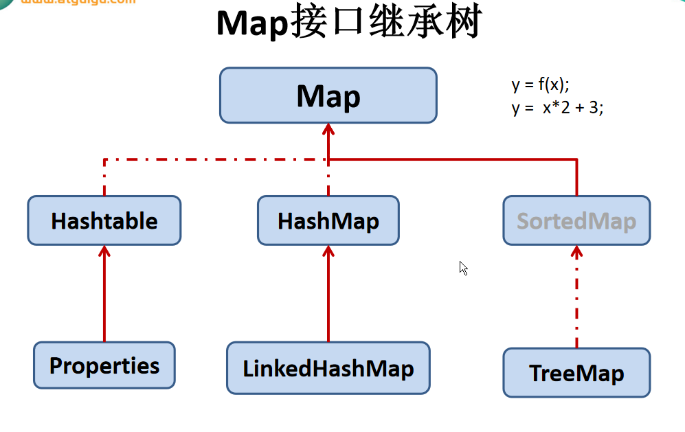

day13 集合
==


## 1. 集合概述
面向对象语言对事物的体现都是以对象的形式，为了方便对多个对象的操作，就要用对象进行存储。

使用Array数组存储对方具有一些弊端，而java集合就像一种容器，可以动态的把多个对象的引用放入容器中。

java集合类可以用于数量不等的多个对象，还可以用于保存具有映射关系的关联数组。

java集合分为Collection和Map两种体系

**Collection接口**

- Set：元素无序、不可重复的集合
- List：元素有序，可以重复 -- 动态数组

**Map接口**：具有映射关系"key-value"对的集合


### Collection接口继承树


方法iterator(): 返回对象类型为Iterator

实现接口子类(若需要线程安全的，可以用Collections同步方法捷解决)

**List 元素有序，可重复**

* ArrayList 元素在内存中连续存储，读取性能好，线程不安全
* LinkedList 元素在内存中不连续，通过链表维护元素的插入顺序，写删性能好，读取性能不错，线程不安全
* **Vector 线程安全**，使用方法大体与ArrayList相同，**效率低，不建议使用**

**Set 元素无序，不可重复**

* HashSet 元素对象的hashCode()值决定改元素存储的位置，遍历顺序与插入顺序不同，判断两个对象是否相同：先通过元素对象hashCode是否想等、不等不相同，若hashCode值相等，再通过equals比较。线程不安全，
* LinkedHashSet 使用链表维护元素插入顺序，遍历顺序为插入顺序。元素存储位置、比较两个元素是否相同的方法同HashSet， 线程不安全
* SortedSet 
* TreeSet 元素必须为同一个类的，自然排序：有对象的int compareTo(Object o)决定；定制排序：创建一个实现了Comparator接口的对象,重写int compare(Object o1, Object o2)方法，把该对象传入TreeSet构造器；比较两个元素是否相同的方法同HashSet，线程不安全

List、Set元素在添加、修改是都会把类型转为Object，所以获取出来的类型也是Object，如果要操作获取出来的数据，需要进行一次类型强

**对象排序接口**

* Comparable
* Comparator

### Map接口继承树


Map key-value键值对，或叫entry，key不能重复，value可以重复

+ Set keySet(); 
+ Collection values(); 
+ Set entrySet();

- HashMap entry顺序由key的int hashCode()决定，遍历顺序与插入顺序不同，与存储顺序相同，**LinkedHaspMap 使用链表维护entry插入顺序，遍历顺序为entry插入顺序。**
- Hashtable 线程安全，比较老。Properties 处理属性文件
- SortedMap， TreeMap key必须为同一个类的，  entry存储顺序由Set keySet()决定，同与TreeSet。其实TreeSet可用看成所有value为空的特殊TreeMap
    		

Map中的key/value在添加、修改是都会把类型转为Object，所以获取出来的类型也是Object，如果要操作获取出来的数据，需要进行一次类型强转


## 2. Collection接口

Collection是List, Set, Queue接口的父类，该接口定义的方法可以操作List, Set, Queue集合

该接口不提供任何实现，有具体的子接口实现

java 5之前，java集合会丢失所有对象的数据类型，把所有对象当成Object类型处理；从java 5增加了泛型，java集合可以记住集合中对象的数据类型


### Collection接口方法

```JAVA
int size() //返回集合中元素的个数
boolean add(E e) //向集合中添加一个元素
boolean addAll(Collection coll) //将一个集合所有元素添加到当前集合中
boolean isEmpty() //判断集合是否为空，是返回true，否则false
void clear() //清空合集所有元素
boolean contains(Object obj) //判断集合中是否包含指定的元素obj，如果包含返回true，否则false。
//判断方法：用到了类中的equals(Object o)方法。若使用了自定义类要重写equals()方法
boolean containsAll(Collection coll) //判断当前集合是否包含coll集合中所有的元素。即判断一个集合是否为当前集合的子集
boolean retainAll(Collectoin coll) //先求集合coll与当前集合的交集，再清空当前集合所有元素，最后把交集集合添加到当前集合中, 即 当前集合 = 当前集合 ∩ coll集合
boolean remove(Object obj) //删除集合中的obj元素。若删除成功返回true,否则返回false
boolean removeAll(Collection coll) //从当前集合中删除与另外一个集合coll的交集所有元素。即 当前集合 - coll集合的差集。
boolean equals(Object obj) //判断一个集合obj与当前集合两者所有的元素是否都相等。
int hashCode() //获取当前集合的hash值
Object[] toArray() //将集合转化成数组
Iterator<E> iterator() //返回一个Iterator接口实现类对象，可用于遍历集合。该方法返回的对象类型为Iterator，有boolean hasNext()、Object next()方法
```


### Iterator遍历集合
Iterator对象称为迭代器（设计模式的一种），主要用于遍历Collection集合元素

所有实现了Collection接口的集合类都有一个iterator()方法，用以返回一个实现了Iterator接口的对象，该对象有boolean hasNext()，E next()、void remove()方法，E格式泛型

Iterator仅用于遍历集合，Iterator本身并没有提供承装对象的能力。如果需要创建Iterator对象，必须有一个别迭代的集合

**在调用it.next()方法之前必须要调用it.hasNext()进行检测。若不调用，且下一条记录无效，**直接调用it.next()会抛出NoSuchElementException异常

方法|方法描述
:---|---
boolean hasNext() |iteration迭代器中还有元素则返回true,否则false
E next() |返回iteration迭代器中的下一个元素
void remove() |从集合中移除迭代器返回的最后一个元素（可选操作）


### for增强版遍历集合元素--foreach

java 5提供了foreach迭代访问集合，同时也可用遍历数组


## 3. List接口
List集合类中元素 有序，不可重复，集合中的每个 元素都有一个对应的顺序索引

List容器中的元素都有一个整数的索引记录在容器中的位置，可根据索引获取该元素

JDK API中List接口的实现类常用的有：ArrayList, LinkedList, Vector

在集合Collection类的基础上添加下面的方法

```JAVA
Object get(int index) // 获取指定下标元素
void add(int index, Object ele) // 指定下标插入一个元素
boolean addAll(int index, Collection eles) // 把一个集合所有元素插入指定下标处
Object remove(int index) // 移除指定下标的元素
Object set(int index, Object ele) // 重置指定下标元素值(更新)
int indexOf(Object obj) // 给定对象首次出现的下标位置，没有则返回 -1
int lastIndexOf(Object obj) // 给定对象最后一次出现的下标位置，没有则返回 -1
List subList(int fromIndex, int toIndex) // List切片处理，截取[开始下标，结束下标)为新的List，注意是左闭右开，相当于取一个子集
```


### 实现类1：ArrayList
ArrayList时List接口的典型实现类， ArrayList本质上是对象引用的一个变长数组

* ArrayList时线程不安全的，Vector时线程安全的（不推荐使用，效率低）
* Arrays.asList(Object...) 方法返回的**List集合既不是ArrayList实例也不是Vector实例**, 返回值是一个**固定长度的List集合**


### 实现类2：LinkedList
对于频繁插入或删除元素操作的List，建议使用LinkedList，效率高，遍历时也有不错的效率

```java
boolean add(E e) // 在最后一个位置插入一个元素，成功则返回true,否则返回false
void add(int index, E element) // 在指定位置插入给定元素
void addFirst(E e) // 在第一个位置插入一个元素
void addLast(E e) // 在最后一个位置插入一个元素
E remove(int index) // 移除指定下标的元素，并返回该元素
E removeFirst() // 移除第一个元素，并返回该元素
E removeLast() // 移除最后一个元素，并返回该元素
E set(int index, E element) // 更新指定位置的元素，并返回该元素(未更新之前的)
E get(int index) // 获取下标元素
E getFirst() // 获取第一个元素
E getLast() // 获取最后一个元素
Object clone() // 深度克隆当前集合，但集合元素的内部并未克隆，Returns a shallow copy of this {@code LinkedList}. (The elements themselves are not cloned.)
```


### 实现类3：Vector
Vector是一个古老的集合，JDK1.0就有了。大多数操作与ArrayList相同，区别之处就是Vector是线程线程安全的，但效率低

在各种List中，最好把ArrayList作为缺省选择。当插入、删除频繁时，使用LinkedList；Vector比ArrayList慢很多，尽量避免使用

```JAVA
void addElement(Object obj)
void insertElementAt(Object obj,int index)
void setElementAt(Object obj,int index)
void removeElement(Object obj)
void removeAllElements()
```


### ListIterator接口

List额外提供了一个listIterato()方法，该方法返回一个ListItera对象，ListIte继承了Iterator接口，提供专门操作List的方法

```java
void add()
boolean hasPrevios()
Object prevois()
boolean hasNext()
Object next()
int nextIndex()
int previousIndex()
void remove()
void set(E e)
void add(E e)
```


### Iterator vs ListIterator
都有hasNext(), next()方法，可以实现顺序遍历。**但ListIterator有boolean hasPrevios(), Object prevois()。可以实现逆向遍历。**

ListIterator可以定位当前元素的索引尾椎，方法nextIndex(), previousIndex()，Iterator无此功能

ListIterator有add()方法，可以向List中插入元素，Iterator无此方法

当ListIterator可以用 set(Object e) 修改元素对象，因为ListIterator的这些功能，可以实现对LinkedList等List数据结构的操作。


## 4. Set接口

Set接口是Collection的子接口，Set接口没有提供额外的方法

存储的元素是无序, 不可重复的.

无序性: 不是随机性, 是指元素在底层存储的位置是无序, 按照一定的方法来确定顺序的.

不可重复性: 不能像Set中添加相同的元素, 也添加不进去

Set判断两个对象是否相同，不是使用==运算符，而是根据对象的boolean equals()方法判断


### Set要求

包括HashSet, LinkedHashSet, TreeSet
* 添加到Set中的元素所在类, **一定要重写equals()和hashCode()方法**
* 当向Set添加元素时
  * 调用此对象所在类的hashCode()方法。计算此对象的哈希值,此哈希值决定了此对象在Set中的存储位置。若此位置还没有存储对象,则此对象直接存储到这个位置。
  * **若这个位置有存储了对象,那么在通过调用该对象的equals()方法比较这两个对象是否相同。如果equals()返回false则添加后面这个元素到Set中，否则不添加**
* hashCode()方法与equals()方法返回值方向要求一致.即返回表示相同或是不相同


### hashCode()方法

* 如果两个元素的 equals() 方法返回 true，但它们的 hashCode() 返回值不相等，hashSet 将会把它们存储在不同的位置，但依然可以添加成功。
* 对于存放在Set容器中的对象，对应的类一定要重写equals()和hashCode(Object obj)方法，以实现对象相等规则
* **重写 hashCode() 方法的基本原则**
  * **同一个对象多次调用 hashCode() 方法应该返回相同的值**
  * **当两个对象的 equals() 方法比较返回 true 时，这两个对象的 hashCode() 方法的返回值也应相等**
  * **对象中用作 equals() 方法比较的 Field，都应该用来计算 hashCode 值**


### 实现类1：HashSet

* HashSet时Set接口的主要实现类，大多数时候都是使用这种
* 使用Hash算法来存储集合中的元素，具有较好的存取、查找性能
* 存储顺序、遍历顺序与元素插入顺序不同
* 线程不安全
* **集合元素可以是null**
* 当向 HashSet 集合中存入一个元素时，HashSet 会调用该对象的 hashCode() 方法来得到该对象的 hashCode 值，然后根据 hashCode 值决定该对象在 HashSet 中的存储位置
* HashSet 集合判断两个元素相等的标准：**两个对象通过int hashCode()方法比较相等，并且两个对象的boolean equals() 方法返回值也相等**


### 实现类2：LinkedHashSet

适用场景：频繁的遍历，较少的插入、删除
* LinkedHashSet是HashSet的子类
* LinkedHashSet 根据元素的 hashCode 值来决定元素的存储位置，但它同时使用链表维护元素的次序，这使得元素看起来是以插入顺序保存的
* LinkedHashSet插入性能略低于 HashSet，但在迭代访问 Set 里的全部元素时有很好的性能
* LinkedHashSet 不允许集合元素重复
* addAll(Set obj) 在当前集合最后添加obj集合中的元素,添加顺序按照obj集合的顺序


### 实现类3：TreeSet
TreeSet是SortedSet接口的实现类，TreeSet可以确保集合中元素处于排序状态

向TreeSet集合中添加的元素必须是同一种类型的数据,不包含自动转换的过来的数据

```JAVA
Comparator comparator() //返回对象的comparator方法
Object first() //获取第一个元素
Object last() //获取最后一个元素
Object lower(Object e) //返回此 set 中严格小于给定元素的最大元素；如果不存在这样的元素，则返回null。 
Object higher(Object e) //返回此 set 中严格大于给定元素的最小元素；如果不存在这样的元素，则返回null
SortedSet subSet(fromElement, toElement) //返回此 set 的部分视图，其元素从fromElement（包括）到toElement（不包括），范围：[fromElement, toElement)
SortedSet headSet(toElement) //返回此 set 的部分视图，其元素严格小于toElement
SortedSet tailSet(fromElement) //返回此 set 的部分视图，其元素大于等于fromElement
```

TreeSet 两种排序方法：自然排序和定制排序。默认情况下，TreeSet 采用自然排序

**自然排序(使用compareTo方法进行比较是否相同)**

* 如果试图把一个对象添加到使用自然排序的 TreeSet 时，**则该对象的类必须实现 Comparable 接口**
* String，int，float，long等已经重写**int compareTo(Object o)方法**，这些类型数据组成的TreeSet默认从小到大排序
* 自定义的来要实现java.lang.Comparable接口并重写int compareTo(Object o)方法,compareTo()方法返回值为0时,表示这两个对象相同在此方法中,指定该类按照哪些属性排序。
* 向TreeSet集合中添加元素时,首先调用对象的int compareTo(Object o)方法进行比较,**若返回值为0，则认为这两个对象是相同的.这通情况下该元素就添加不进来**
* 对于 TreeSet 集合而言，它判断两个对象是否相等的唯一标准是：两个对象通过 compareTo(Object obj) 方法比较返回值
* int compareTo(Object o)，int hashCode()，boolean equals()三个方法取值方向要求同时一致

**定制排序(使用与不能更改类的场景)**

* **创建一个实现了Comparator接口的对象,重写int compare(Object o1, Object o2)方法**
* 利用int compare(T o1,T o2)方法，比较o1和o2的大小
  * 如果方法返回正整数，则表示o1大于o2
  * 如果返回0，表示相等
  * 返回负整数，表示o1小于o2。
* int compare(Object o1, Object o2)，int hashCode()，boolean equals()三个方法取值方向要求同时一致
* set2:把set1中创建的comparator实例以形参传入TreeSet构造器。此时，仍然只能向TreeSet中添加类型相同的对象。否则发生ClassCastException异常
* 使用定制排序是不需要实现自定义类的Comparable接口,如果有实现,则定制排序优先
* 使用定制排序判断两个元素相等的标准是：通过Comparator比较两个元素返回了0


### Set交集, 并集, 差集运算
Set接口是Collection的子接口，Set接口没有提供额外的方法，而[Collection](#Collection接口方法)也没有提供直接取交集、并集、差集的方法，这里就用Collection原有的方法来组合出交集、并集、差集的效果


## 5. Map接口
**Map与Collection并列存在**。用于保存具有映射关系的数据:Key-Value，称为entry

Map 中的 key 和  value 都可以是任何引用类型的数据

Map 中的 key 用Set来存放，不允许重复，即同一个 Map 对象所对应的类，须重写hashCode()和equals()方法

key 和 value 之间存在单向一对一关系，即通过指定的 key 总能找到唯一的、确定的 value

### 常用方法

```java
//添加、删除操作方法
Object put(Object key, Object value)  //添加、或更新一个元素到HashMap中
Object remove(Object key) //删除指定key的元素
void putAll(Map t) //把Map t中所有元素添加到当前Map中
void clear() //清除当前map中所有元素

//元素查询操作方法
Object get(Object key) //获取指定key的元素，若key不存在则返回null
boolean containsKey(Object key) //当前map所有的key中是否包含指定key，是返回true,否则false
boolean containsValue(Object value) //当前map所有的value中是否包含指定的value，是返回true,否则false
int size() //返回map元素个数
boolean isEmpty() //当前map是否为空，是返回true,否则false
boolean equals(Object obj) //当前map与指定的obj map是否相等，即所有entry相等

//元视图操作方法
Set keySet() //获取当前map所有的key，值为Set
Collection values() //获取当前map所有的value，值为Collection
Set entrySet() //获取当前map所有的entry，值为Set
```


### 特点
* **Map的key, value都可以为null**
* key、entry使用Set存储，不可重复，value使用Collection存储，可以重复
* put()添加元素到map时，如果前面已经存在一个相同的key，那么新的key对应的value将覆盖旧的value
* Map接口的常用实现类：HashMap、LinkedHashMap、TreeMap、Properties


### 实现类1：HashMap

* entry顺序存储顺序与key的hash值有关，与put添加的顺序无关
* HashMap是 Map 接口使用频率最高的实现类
* HashMap判断两个 key 相等的标准是：两个 key 通过 equals() 方法返回 true，hashCode 值也相等
* HashMap判断两个 value相等的标准是：两个 value 通过 equals() 方法返回 true

```java
// 其他类型的Map类也类似

HashMap hmap = new HashMap() {
    { // 匿名内部类
        put("type", "支出");
        put("price", price);
        put("item", item);
    }
};
```


### 实现类2：LinkedHashMap
* LinkedHashMap 是 HashMap 的子类
* LinkedHashSet类似，LinkedHashMap 可以维护 Map 的迭代顺序（使用链表）：迭代顺序与 Key-Value 对的插入顺序一致


### 实现类3：TreeMap
TreeMap存储 Key-Value 对时，需要根据 key-value 对进行排序。TreeMap 可以保证所有的 Key-Value 对处于有序状态

TreeMap 的 Key 的排序:自然排序、定制排序
* 自然排序：TreeMap 的所有的 Key 必须实现 Comparable 接口并重写int compareTo(Object obj)方法，而且所有的 Key 应该是同一个类的对象，否则将会抛出 ClasssCastException
* 定制排序：创建 TreeMap 时，传入一个 Comparator 对象，要求重写Comparator接口中的int compare(Object o1, Object o2)，该对象负责对 TreeMap 中的所有 key 进行排序。此时不需要 Map 的 Key 实现 Comparable 接口

使用自定义类作为TreeMap的key，所属类需要重写equals()和hashCode()方法，且equals()方法返回true时，compareTo()方法应返回0


### 实现类4：Hashtable
Hashtable是个古老的 Map 实现类，**线程安全。**

与HashMap不同，**Hashtable 不允许使用 null 作为 key 和 value**， 与HashMap一样，Hashtable 也不能保证其中 Key-Value 对的顺序

Hashtable判断两个key相等、两个value相等的标准，与hashMap一致


### 实现类5：Properties

Properties 类是 Hashtable 的子类，该对象用于处理属性文件

由于属性文件里的 key、value 都是字符串类型，所以 Properties 里的 key 和 value 都是字符串类型

存取数据时，建议使用setProperty(String key,String value)方法和getProperty(String key)方法


## 6. 工具类：Collections

Collections时一个操作List、Set、Map等集合的工具类

Collections 中提供了一系列静态的方法对集合元素进行排序、查询和修改等操作，还提供了对集合对象设置不可变、对集合对象实现同步控制等方法

**Collections常用方法（均为static方法）**

```java
//排序操作
void reverse(List l) //反转List l中元素的顺序
void shuffle(List l) //对List l集合元素进行随机排序
void sort(List l) //根据元素的自然顺序对指定List l集合元素按升序排序
void sort(List l, Comparator c) //根据指定的Comparator c生产的顺序对List l集合元素进行排序
void swap(List l, int i, int j) //将指定List l集合中i与j处的元素进行交换

// 查找、替换
Object max(Collection c) //根据元素的自然顺序，返回给定集合中位置最大的元素
Object max(Collection c, Comparator com) //根据Comparator com指定的顺序，返回给定集合中位置最大的元素
Object min(Collection) //根据元素的自然顺序返，回给定集合中位置最小的元素
Object min(Collection c, Comparator com) //根据Comparator com指定的顺序，返回给定集合中位置最小的元素
int frequency(Collection c, Object o) //返回指定命令中指定元素出现的次数
void copy(List dest, List src) //List src中的元素复制到 List dest中，dest的长度必须>= src的长度
boolean replaceAll(List l, Object oldVal, Object newVal) //使用新值newVal替换List l中所旧值oldVal

// 同步控制，可以解决多线程并发访问集合时的线程安全问题
static<T> Collection<> synchronizedCollection(Collection<T> c)
static<T> List<> synchronizedList(List<T> l)
static<T> Map<K,V> synchronizedMap(Map<K,V> m)
static<T> Set<T> synchronizedSet(Set<T> s)
static<T> SortedMap<K,V> synchronizedSortedMap(SortedMap<K,V> m)
static<T> SortedSet<T> synchronizedSortedSet(SortedSet<T> s)
```


## 7. 互转

### List/Set互转

```java
//List转Set
Set<String> set = new HashSet<>(list);
//Set转List
List<String> list1 = new ArrayList<>(set);
```

### Array/Set互转
```java
//array转set
String[] s = new String[]{"A", "B", "C", "D","E"};
Set<String> set = new HashSet<>(Arrays.asList(s));
System.out.println("set: " + set);

//set转array
String[] sArr = set.toArray();
```


## 8. Queue列队

队列(Queue)是一种经常使用的集合。 Queue实际上是实现了一个先进先出（FIFO：First In First Out）的有序表。 它和List的区别在于，List可以在任意位置添加和删除元素， 而Queue只有两个操作：

- 把元素添加到队列末尾
- 从队列头部取出元素
- 生活例子：超市的收银台就是一个队列

### 特点

元素一头进一头出， 元素先进入的先取出，是顺序的， 在Java的标准库中，队列接口Queue定义了以下几个方法

```java
int size()//获取队列长度；
boolean add(E)//boolean offer(E)：添加元素到队尾；
E remove()//E poll()：获取队首元素并从队列中删除；
E element()//E peek()：获取队首元素但不从队列中删除。
```

Queue方法比较

| 操作类型\操作失败处理方式 | throw Exception | 返回false或null    |
| :------------------------ | :-------------- | :----------------- |
| 添加元素到队尾            | add(E e)        | boolean offer(E e) |
| 取队首元素并删除          | E remove()      | E poll()           |
| 取队首元素但不删除        | E element()     | E peek()           |

注意：**不要把null添加到队列中，否则poll()方法返回null时，很难确定是取到了null元素还是队列为空**。


### 示例

poll()方法取队列首元素、使用peek()方法取队列首元素对比

```java
import org.junit.Test;

import java.util.List;
import java.util.Queue;
import java.util.LinkedList;
  
public class QueueTest {
    /**
     * poll()方法取队列首元素
     */
    @Test
    public void test1() {
        Queue<String> q = new LinkedList<>();
        // 添加元素到队列
        q.offer("apple");
        q.offer("pear");
        q.offer("banana");
        // 从队列中取出元素
        System.out.println(q.poll()); // apple
        System.out.println(q.poll()); // pear
        System.out.println(q.poll()); // banana
        System.out.println(q.poll()); // null,因为此时队列是空的
        System.out.println(q.poll()); // null
    }

    /**
     * 使用peek()方法取队列首元素
     */
    @Test
    public void test2() {
        Queue<String> q = new LinkedList<>();
        // 添加元素到队列
        q.offer("apple");
        q.offer("pear");
        q.offer("banana");
        // peek()每次取的元素都相同，因为该方法不删除元素
        System.out.println(q.peek()); // apple
        System.out.println(q.peek()); // apple
        System.out.println(q.peek()); // apple
        System.out.println(q.peek()); // apple
    }
}
```


9. PriorityQueue
--

在银行柜台办业务时，我们假设只有一个柜台在办理业务，但是办理业务的人很多。可以每个人先取一个号，例如：A1、A2、A3……然后，按照号码顺序依次办理，实际上这就是一个Queue。如果这时来了一个VIP客户，他的号码是V1，虽然当前排队的是A10、A11、A12……但是柜台下一个呼叫的客户号码却是V1。

**要实现“VIP插队”的业务**，用Queue就不行了，因为Queue会严格按FIFO的原则取出队首元素。需要的是优先队列：PriorityQueue


### 特点

* PriorityQueue和Queue的区别在于，它的出队顺序只与元素的优先级有关，与插入顺序无关

* PriorityQueue调用remove()或poll()方法，返回的总是优先级最高的元素

* PriorityQueue的元素，必须实现Comparable接口，PriorityQueue会根据元素的排序顺序决定出队的优先级

* PriorityQueue的元素所性类未实现Comparable，则需要通过Comparator自定义排序算法


### 示例

```java
import org.junit.Test;

import java.util.Comparator;
import java.util.PriorityQueue;
import java.util.Queue;

public class PriorityQueueTest {
    @Test
    public void test1() {
        Queue<String> q = new PriorityQueue<>();
        // 添加元素到队列
        q.offer("apple");
        q.offer("pear");
        q.offer("banana");

        // 取首元素
        System.out.println(q.poll()); // apple
        System.out.println(q.poll()); // banana
        System.out.println(q.poll()); // pear
        System.out.println(q.poll()); // null,因为此时队列是空的
        /*
        * 我们放入的顺序是"apple"、"pear"、"banana"，
        * 但是取出的顺序却是"apple"、"banana"、"pear"，
        * 这是因为从字符串的排序看，"apple"排在最前面，"pear"排在最后面。
        * */
    }
}
```

```java
import org.junit.Test;

import java.util.Comparator;
import java.util.PriorityQueue;
import java.util.Queue;
  
public class PriorityQueueTest {
    @Test
    public void test2() {
        Queue<User> q = new PriorityQueue<>(new UserComparator());
        User u1 = new User("Bob", "A10");
        User u2 = new User("Alice", "A2");
        User u3 = new User("Boss", "V1");
        User u4 = new User("Cucker", "A3");
        q.offer(u1);
        q.offer(u2);
        q.offer(u3);

        System.out.println(q.poll()); // Boss/V1
        q.offer(u4); // 插入的顺序没有影响取出的顺序
        System.out.println(q.poll()); // Alice/A2
        System.out.println(q.poll()); // Cucker/A3
        System.out.println(q.poll()); // Bob/A10
        System.out.println(q.poll()); // null，此时队列为空
    }
}

class User {
    public String name;
    public String number;

    // 构造器
    public User(String name, String number) {
        this.name = name;
        this.number = number;
    }

    // 方法
    @Override
    public String toString() {
        return name + "/" + number;
    }
}

/**
 * 银行用户排队排序比较器
 */
class UserComparator implements Comparator<User> {
    @Override
    public int compare(User o1, User o2) {
        // 两人号码开头字母相同，直接比较数字大小
        if (o1.number.charAt(0) == o2.number.charAt(0)) {
            Integer n1 = Integer.parseInt(o1.number.substring(1));
            Integer n2 = Integer.parseInt(o2.number.substring(1));
            return n1.compareTo(n2);
        }
        // o1号码以V开头,优先级高，需要排到前面去
        if (o1.number.charAt(0) == 'V') {
            return -1;
        }
        return 1;
    }
}
```

实现PriorityQueue的关键在于提供的UserComparator对象，它负责比较两个元素的大小（较小的在前）。UserComparator总是把V开头的号码优先返回，只有在开头相同的时候，才比较号码大小。


10. Deque
--

Deque元素允许两头都进，两头都出，这种队列叫双端队列（Double Ended Queue），即Deque接口实际上扩展自Queue

### 特点

* 元素既可以添加到队尾，也可以添加到队首
* 元素既可以从队首获取，又可以从队尾获取
* **避免把null添加到队列**


### Queue和Deque方法比较

| 方法\队列类型      | Queue                 | Deque                          |
| :----------------- | :-------------------- | :----------------------------- |
| 添加元素到队尾     | add(E e)、offer(E e)  | addLast(E e)、offerLast(E e)   |
| 取队首元素并删除   | E remove()、E poll()  | E removeFirst()、E pollFirst() |
| 取队首元素但不删除 | E element()、E peek() | E getFirst()、E peekFirst()    |
| 添加元素到队首     | 无                    | addFirst(E e)、offerFirst(E e) |
| 取队尾元素并删除   | 无                    | E remove()、E pollLast()       |
| 取队尾元素但不删除 | 无                    | E getLast()、E peekLast()      |


### 示例

```java
import org.junit.Test;

import java.util.Deque;
import java.util.LinkedList;

public class DequeTest {
    @Test
    public void test1() {
        Deque<String> deque = new LinkedList<>();
        deque.offerLast("A");
        deque.offerLast("B");
        deque.offerFirst("C");
        deque.offerFirst("D");
        // 当前队列顺序：D C A B
        System.out.println(deque.pollFirst()); // D
        System.out.println(deque.pollLast()); // B
        System.out.println(deque.pollFirst()); // C
        System.out.println(deque.pollFirst()); // A
        System.out.println(deque.pollFirst()); // null
    }

}
```


11. Stack栈
--

栈(Stack)是一种后进先出（LIFO：Last In First Out）的数据结构。

### 方法

* 把元素压栈：push(E e)
* 把栈顶的元素"弹出"：E pop()
* 取栈顶元素但不弹出：E peek()
* 判断栈是否为空：boolean empty()
* 搜索指定元素在栈中的索引：int search(Object o)

为什么Java的集合类没有单独的Stack接口呢？因为有个遗留类名字就叫Stack，出于兼容性考虑，Stack也可以使用，它继承了Vector类

**建议不要使用遗留类Stack。所以没办法创建Stack接口，只能用Deque接口来“模拟”一个Stack了.**

当我们把Deque作为Stack使用时，注意只调用push()/pop()/peek()方法，不要调用addFirst()/removeFirst()/peekFirst()方法，这样代码更加清晰

### Deque代替Stack方法

* 把元素压栈：push(E e) /addFirst(E e)
* 把栈顶的元素"弹出"：E pop() /E removeFirst()
* 取栈顶元素但不弹出：E peek() /E peekFirst()

### 示例

**示例1：**Stack在计算机中使用非常广泛，JVM在处理Java方法调用的时候就会通过栈这种数据结构维护方法调用的层次

```java
static void main(String[] args) {
    foo(123);
}

static String foo(x) {
    return "F-" + bar(x + 1);
}

static int bar(int x) {
    return x << 2;
}
```

JVM会创建方法调用栈，每调用一个方法时，先将参数压栈，然后执行对应的方法；当方法返回时，返回值压栈，调用方法通过出栈操作获得方法返回值。

因为方法调用栈有容量限制，嵌套调用过多会造成栈溢出，即引发StackOverflowError：

```java
// 测试无限递归调用

public class Main {
    public static void main(String[] args) {
        increase(1);
    }

    static int increase(int x) {
        return increase(x) + 1;
    }
}
```

**示例2：**利用栈对整数进行进制的转换。把一个int整数12500转换为十六进制表示的字符串

首先我们准备一个空栈

```text
│   │
│   │
│   │
│   │
│   │
│   │
│   │
│   │
└───┘
```

然后计算12500÷16=781…4，余数是4，把余数4压栈

```text
│   │
│   │
│   │
│   │
│   │
│   │
│   │
│ 4 │
└───┘
```

然后计算781÷16=48…13，余数是13，13的十六进制用字母D表示，把余数D压栈

```text
│   │
│   │
│   │
│   │
│   │
│ D │
│   │
│ 4 │
└───┘
```

然后计算48÷16=3…0，余数是0，把余数0压栈

```text
│   │
│   │
│   │
│ 0 │
│   │
│ D │
│   │
│ 4 │
└───┘
```

最后计算3÷16=0…3，余数是3，把余数3压栈

```text
│   │
│ 3 │
│   │
│ 0 │
│   │
│ D │
│   │
│ 4 │
└───┘
```

当商是0的时候，计算结束，我们把栈的所有元素依次弹出，组成字符串30D4，这就是十进制整数12500的十六进制表示的字符串


**示例2：**计算中缀表达式

在编写程序的时候，我们使用的带括号的数学表达式实际上是中缀表达式，即运算符在中间，
例如：1 + 2 * (9 - 5)。

但是计算机执行表达式的时候，它并不能直接计算中缀表达式，而是通过编译器把中缀表达式转换为后缀表达式，例如：1 2 9 5 - * +

首先准备一个空的栈

```text
│   │
│   │
│   │
│   │
│   │
│   │
│   │
│   │
└───┘
```

然后我们依次扫描后缀表达式1 2 9 5 - * +，遇到数字1，就直接扔到栈里

```text
│   │
│   │
│   │
│   │
│   │
│   │
│   │
│ 1 │
└───┘
```

紧接着，遇到数字2，9，5，也扔到栈里

```text
│   │
│ 5 │
│   │
│ 9 │
│   │
│ 2 │
│   │
│ 1 │
└───┘
```

接下来遇到减号时，弹出栈顶的两个元素，并计算9-5=4，把结果4压栈

```text
│   │
│   │
│   │
│ 4 │
│   │
│ 2 │
│   │
│ 1 │
└───┘
```

接下来遇到\*号时，弹出栈顶的两个元素，并计算2\*4=8，把结果8压栈

```text
│   │
│   │
│   │
│   │
│   │
│ 8 │
│   │
│ 1 │
└───┘
```

接下来遇到+号时，弹出栈顶的两个元素，并计算1+8=9，把结果9压栈

```text
│   │
│   │
│   │
│   │
│   │
│   │
│   │
│ 9 │
└───┘
```

扫描结束后，没有更多的计算了，弹出栈的唯一一个元素，得到计算结果9