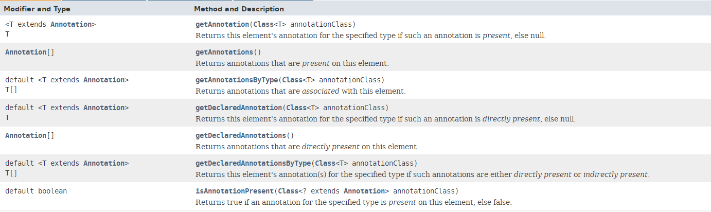

day14 高级类特性
==


1. 泛型
--

广泛的类型**用于类, 接口和方法代码**可以应用于非常广泛的类型。 代**码与它们能够操作的数据类型不再绑定在一起**，**可以用于多种数据类型，  不仅可以复用代码，降低耦合**。提高代码的可读性和安全性。

泛型作用
* 把集合中元素, 类, 接口的内容限制为指定的数据类型，但未使用之前又不能确定是哪种数据类型，在实例化时指定数据类型
* 解决元素存储的安全性问题
* 解决获取数据元素时，需要类型强转的繁琐问题


### 使用
* 泛型的声明
* 符号：<>
* 格式：<类型列表>, 如<Boolean>, <String, Integer>，可以写多个数据类型
* interface List<T> 和class TestGen<K, V>其中，T、K、V不代表值，而是表示类型。这里使用任意字母都可以，通常大写。常用T表示，T是Type的缩写

* 泛型的实例化
```java
//一定要在类名后面指定类型参数的值(类型)

List<String> strList = new ArrayList<>();
Iterator<Customer> iterator = customer.iterator();
//T只能是类，不能用基本数据类型填充
```


### 用途

* 在集合中使用泛型
* 自定义泛型类
* 泛型方法
* 泛型接口


### 规则

* **泛型类对象实例化时不指定泛型，默认类型为 Object**
* 泛型不同的引用不能相互赋值
* 加入集合中的对象类型必须与指定的泛型类型一致
* **静态方法中不能使用类的泛型，因为静态方法在类加载时就确定了**
* catch的异常类型不能为泛型
* 构造器中不能使用泛型


### 接口
```java
// 示例
public interface USB<T> {
    public abstract void start(T t);
    void stop(T t);
}
```


### 方法
* **普通类， 泛型类中都可以定义泛型方法**
* 在泛型方法中定义泛型参数，参数的类型就是传入数据的类型
```java
//[访问权限] <泛型> 返回类型 方法名([泛型标识] 参数名称) [throws 异常类型类表] {
    
//}
    
public class DAO {
    public <E> E get(int id, E e) {
        E result = null;
        return result;
    }
}    
```


### 继承

* 若B是A的一个子类型，而G是具有泛型声明的类或接口，**G<B>并不是G<A>的子类型**

* **子类不为泛型类：继承时指定父类泛型中的类型**

  ```java
  class SubCustomer extends Customer<Integer> { }
  ```

* **子类仍为泛型类：继承时子类使用泛型**

  ```java
  class SubCustomer2<T> extends Customer<T> { }
  ```


### 通配符

* 类型通配符符号：<?>, 如List<?>, Map<?, ?>

* List<A>、List<B> ... ... 都是List<?>的子类

* **读取 List<?> 对象list中的元素时，永远是安全的，无论list的元素真实类型是什么，list包含都是Object**

* 写入、修改list中的元素时，不行，因为我们不知道list的元素类型，唯一例外的是null，null是所有类的成员

* **<? extends A> 只能存放A及其子类**，元素可以增查改删

* **<? super A>  只能存放A及其父类**

* **<? extends Comparable> 只允许泛型为实现Comparable接口的实现类的引用调用**

* 不能向声明为通配符的集合中添加、修改元素(当元素为null除外)，但可以获取、删除元素


## 2. 枚举类

JDK 1.5之前需要自定义枚举类

JDK 1.5新增enum关键字用于定义枚举类

若枚举类只有一个成员，则可用作为一种单例模式的实现方式


### 属性

* 枚举类对象的属性不应被改动，所以需要用private final修饰
* 枚举类的属性应该在构造器中为其赋值
* **若枚举类显示的定义了带参的构造器，则在列出枚举类对象时也必须传入参数**


### 自定义

+ [实例变量] 属性，声明为private final
+ **[构造器] private构造器，并初始化属性**
+ **[方法] 提供public方法访问属性**  
+ [类变量] 在内的内部创建枚举类的实例，将类的对象声明public static final 


### Enum

* 使用 enum 定义的枚举类默认继承了 java.lang.Enum 类
* 格式 enum ClassName { }
* 必须在类的第一行列出声明枚举类实例对象，不要其他修饰（效果相当于public static final），使用","分隔多个实例对象，;结尾，不需要new关键字
* 属性是使用**private final修饰**
* **无修饰的构造器，默认已经被private修饰，写上也可以**
* JDK 1.5 中可以在switch表达式中使用enum定义的枚举类的实例对象作为表达式，case子句可以直接使用枚举类实例对象的名字，无需添加枚举类作为限定


### 方法

* T[] values() 获取枚举类的所有实例组成的数组，返回值为数组T[]
* T valueOf(String instanceName) 通过实例名获取类对应的实例对象，不存在的实例名，报 IllegalArgumentException 异常


### 接口

* 与普通类一样，所以可以实现一个或多个接口
* 可以在枚举类中实现接口
* 也可以每个实例对象中都实现接口，这是与一般类不同的，可以让不同的枚举类对象调用各自重写的方法，执行效果


3. 注解
--

* Annotation 其实就是代码里的特殊标记, 这些标记可以在编译, 类加载, 运行时被读取, 并执行相应的处理. 通过使用 Annotation, 程序员可以在不改变原有逻辑的情况下, 在源文件中嵌入一些补充信息
* JDK 1.5开始开始，java增加了Annotation注解，用于对元数据(MetaData)的支持
* Annotation 可以像修饰符一样被使用, 可用于修饰包,类, 构造器, 方法, 成员变量, 参数, 局部变量的声明, 这些信息被保存在 Annotation 的 “name=value” 对中
* Annotation 能被用来为程序元素(类, 方法, 成员变量等) 设置元数据
* 符号：@


### 常用的Annotation

* **@Override 限定重写父类方法**，该注释只能用于方法，显式的指明方法要重写，如果权限修饰, 方法名等有错误能有提示
* **@Deprecated** 用于表示某个程序元素（类，方法等）已经过时，仍能正常正常运行和使用，一般表示有更好的方法，建议使用新方法，生成的doc api中有Deprecated标识
* **@SuppressWarnings 抑制编译器警告**


### 自定义注解

* 格式：public @interface MyAnnotation { }
* 定义新的 Annotation 类型使用 @interface 关键字
* **Annotation 的成员变量在 Annotation 定义中以无参数方法的形式来声明**. **其方法名和返回值定义了该成员的名字和类型.**
* 可以在定义 Annotation 的成员变量时为其指定初始值, 指定成员变量的初始值可使用 default 关键字
* **没有成员定义的 Annotation 称为标记**

```JAVA
public @interface MyAnnotation{
    String name() default "atguigu";
}
```


### 元注解

JDK 的元注解 用于修饰其他注解 定义 4个元注解

**@Retention 指定注解的生命周期**

```JAVA
//编译器直接丢弃这种策略的注释
@RetentionPolicy.SOURCE

// 编译器将把注释记录在 class 文件中. 当运行 Java 程序时, JVM 不会保留注解。 这是默认值
@RetentionPolicy.CLASS
  
// 编译器将把注释记录在 class 文件中. 当运行 Java 程序时, JVM 会保留注释. 程序可以通过反射获取该注释  
@RetentionPolicy.RUNTIME 
```


**@Target 用于修饰 Annotation 作用于的元素**。@Target(value) value可选值

```JAVA
TYPE, FIELD, METHOD, PARAMETER, CONSTRUCTOR, LOCAL_VARIABLE, ANNOTATION_TYPE, PACKAGE, TYPE_PARAMETER, TYPE_USE, MODULE
```


**@Documented 用于指定被该元 Annotation 修饰的 Annotation 类将被 javadoc 工具提取成文档**。定义为Documented的注解必须设置**Retention值为RUNTIME**

@Inherited 被它修饰的 Annotation 将具有继承性.如果某个类使用了被 @Inherited 修饰的 Annotation, 则其子类将自动具有该注解


### Annotation信息

JDK 1.5 在 java.lang.reflect 包下新增了 AnnotatedElement 接口, 该接口代表程序中可以接受注解的程序元素



### 内置注解

```java
// SuppressWarnings
@Target({TYPE, FIELD, METHOD, PARAMETER, CONSTRUCTOR, LOCAL_VARIABLE, MODULE})
@Retention(RetentionPolicy.SOURCE)
public @interface SuppressWarnings {
    String[] value();
}


// Override
@Target(ElementType.METHOD)
@Retention(RetentionPolicy.SOURCE)
public @interface Override {
}


// Deprecated
@Documented
@Retention(RetentionPolicy.RUNTIME)
@Target(value={CONSTRUCTOR, FIELD, LOCAL_VARIABLE, METHOD, PACKAGE, MODULE, PARAMETER, TYPE})
public @interface Deprecated {
    String since() default "";
    boolean forRemoval() default false;
}
```

