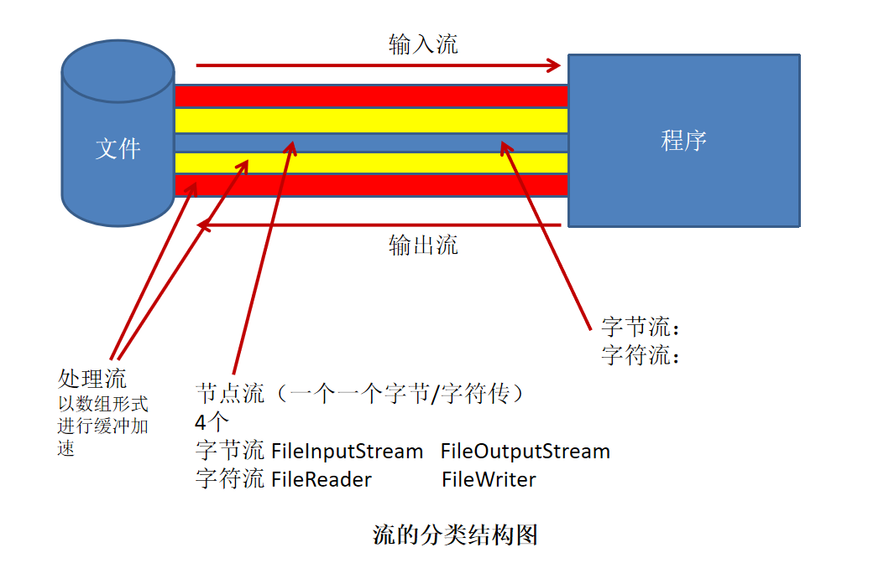

day15 IO流
==


## 1. File类
java.io.File类，**可以新建、删除、重命名文件和目录。操作文件内容需要使用IO流**

```JAVA
// 以pathname为路径创建File对象，可以是绝对路径或者相对路径，如果pathname是相对路径，则默认的当前路径在系统属性user.dir中存储
public File(String pathname)

// 以parent为父路径，child为子路径创建的File对象
public File(String parent, String child)
  
// File类的静态属性String separator存储了当前系统的路径分隔符。
File file2 = new File("E:\\dev\\java_2019\\day15\\testLab\\lab1");  
File file3 = new File("E:/dev/java_2019//day15/testLab/lab1/qq.exe"); 
```

### 访问文件名

```JAVA
String getName() //获取文件名
String getPath() //获取路径
String getAbsoluteFile()  //获取文件绝对路径
String getAbsolutePath() //获取目录绝对路径
String getParent() //获取父路径
boolean renameTo(File newFile) //重命名文件或目录，当目标文件名、目录名存在时，则重名失败
```

### 文件检测

```java
boolean exists() //是否存在
boolean canWrite() //是否能写
boolean canRead() //是否可读
boolean isFile() //是否为文件
boolean isDirectory() //是否为目录
boolean canExecute() //是否可执行
```

### 获取常规文件信息

```JAVA
long lastModified() //返回文件、目录修改时间戳
long length() //字节长度，The length, in bytes, of the file denoted by this abstract pathname
```

### 文件相关操作

```java
boolean createNewFile() //创建新文件，父目录不存在时，报IOException异常；若文件存在，创建失败
boolean delete() //删除文件或空目录，非空目录删除失败
```

### 目录相关操作

```java
boolean mkDir() //创建目录，父目录不存在时创建失败
boolean mkDirs() //创建多层目录，若父目录不存在时，父目录一同创建
String[] list() //列出指定路径下的文件和目录，只显示当前层的，返回String数组
File[] listFiles() //列出指定路径下的文件和目录，只显示当前层的，返回File数组
```

### 设置属性

```java
boolean setReadOnly()
boolean setLastModified()
boolean setWritable()
boolean setExecutable()
```


## 2. JAVA IO原理
IO流用来处理设备之间的数据传输, **数据的输入/输出操作以流(stream)的方式进行**

**输入Input**: 从外部读取数据到程序内存

**输出Output**: 将程序数据输出到硬盘, U盘, 网络, 屏幕等


## 3. 流的分类

按操作数据单位分类：
* 字节流bytes stream (8 bit)
* 字符流character stream (16 bit)

按数据流的方向分类
* 输入流
* 输出流

按流的角色分类
* 节点流
* 处理流




### 抽象基类
流方向 |字节流 |字符流
:--- |--- |---
输入流 |InputStream |Reader
输出流 |OutputStream |Writer


### IO流体系

分类 |字节输入流(byte) |字节输出流(byte) |字符输入流(char) |字符输出流(char) 
:--- |--- |--- |--- |--- 
抽象基类 |InputStream |OutputStream |Reader |Writer
访问文件 |FileInputStream <br>int read()是阻塞的 |FileOutputStream |FileReader |FileWriter
访问数组 |ByteArrayInputStream |ByteArrayOutputStream |CharArrayReader |CharArrayWriter
访问管道 |PipedInputStream |PipedOutputStream |PipedReader |PipedWriter
访问字符串 | | |StringReader |StringWriter
缓冲流 |BufferedInputStream <br>int read()非阻塞的 |BufferedOutputStream <br>flush() 每次写入后执行一次，保证最后的缓冲内容也被写入 |BufferedReader <br>String readLine() 读取的内容不包括行尾的换行符 |BufferedWriter <br> flush() 每次写入后执行一次，保证最后的缓冲内容也被写入
转换流 | | |InputStreamReader |OutputStreamWriter
对象流 |ObjectInputStream |ObjectOutputStream | | 
打印流(输出) | |PrintStream | |PrintWriter
推回输入流 |PushbackInputStream | |PushbackReader | 
数据流(特殊流) |DataInputStream |DataOutputStream | | 


### 节点流和处理流

节点流可以从一个特定的数据源读写数据, **一次对一个字节或字符地操作**
* FileInputStream, FileOutputStream
* FileReader, FileWriter

处理流是"连接"在已经存在的流(节点流或处理流)之上，通过对数据的处理为程序提供更强大的读写功能，对流的继续封装处理, **一次对多个字节或字符地操作**
* BufferedInputStream, BufferedOutputStream
* BufferedReader, BuffereWriter


## 4. InputStream，Reader

InputStream方法

```JAVA
int read()
int read(byte[] b)
int read(byte[] b, int off, int len)
void close()
```

Reader方法

```java
int read()
int read(char[])
int read(char[] c, int off, int len)
void close()
```


## 5. OutputStream，Writer

OutputStream方法

```java
void write(int b)
void writer(byte[] b)
void write(byte[] b, int off, int len)
void flush()
void close() //需要先刷新，再关闭流对象
```

Writer方法

```java
void write(int c)
void writer(char[] cbuf)
void write(char[] cbuf, int off, int len)
void write(String str) // 因为字符流以字符为单位在操作，String就是char[]数组
void write(String str, int off, int len)
void flush()
void close()
```


## 6. 处理流

### 缓冲流

为了提高数据读写的速度，JavaAPI提供了带缓冲功能的流类，会创建一个内部缓冲区数组提高了读写的效率

**字节缓冲流**

* BufferedInputStream
* BufferedOutputStream

**字符缓冲流**

* BufferedReader
* BufferedWriter


### 转换流

转换流提供了在字节流和字符流之间的转换

* InputStreamReader 字节流 转换成字符流，解码过程

  ```java
  public InputStreamReader(InputStream in)
  public InputStreamReader(InputStream, String chasetName)
  ```

* OutputStreamWriter 字符流 转换成 字节流，编码过程

  ```java
  public OutputStreamWriter(OutputStream out)
  public OutputStreamWriter(OutputStream out, String charsetName)
  ```


### 标准输入输出流

System.in和System.out分别代表了系统标准的输入和输出设备, 默认输入设备是**键盘**，输出设备是**显示器**

**System.in的类型是InputStream**

**System.out的是类型是PrintStream**


### 打印流

PrintStream和PrintWriter，不会抛出异常且有自动flush

* 提供了一系列重载的print和println方法，用于多种数据类型的输出
* System.out返回的是PrintStream的实例


### 数据流

方便操作java语言的基本数据类型的数据，可以使用数据流

* **DataInputStream 数据输入流**，套接在InputStream 节点流上

  ```java
  boolean readBoolean()
  char readChar()
  double readDouble()
  long readLong()
  String readUTF()
  byte readByte()
  float readFloat()
  short readShort()
  int readInt()
  void readFully(byte[] b)
  ```

* **DataOutputStream 数据输出流**，套接在OutputStream 节点流上

  ```java
  void writeBoolean(boolean v)
  void writeChar(int v)
  void writeDouble(double v)
  void writeLong(long v)
  void writeByte(int v)
  void writeFloat(float v)
  void wirteInt(int v)
  void writeBytes(String s)
  void writeChars(String s)
  void write(byte b[], int off, int len)
  void write(int b)
  void flush()
  ```

  


### 对象流

ObjectInputStream, ObjectOutputStream,用于存储和读取对象的处理流，它的强大之处是可以把对象写入到存储设备中，也能把对象从外部设备中读取出来

#### java.io.EOFException异常

new ObjectOutputStream(new FileOutputStream("file.txt"))一创建对象流，file.txt文件内容就被替换成4个字节的内容，准备后续的写入。  

如果同时开了 **ObjectInputStream, ObjectOutputStream，ObjectInputStream的实例化和操作必须放在ObjectOutputStream的实例化和操作的前面，才能保证正常的读取文件内容, 否则内容已经被替换成4个字节内容，所有就报EOFException异常了**。 

建议不同时打开ObjectInputStream, ObjectOutputStream，对象输入流读取操作完后，关闭对象输入流，再打开对象输出流操作

#### 对象的序列化

+ 把内存中的**java对象换成与平台无关的二进制流**，从而允许把这种二进制流持久地保存到硬盘上，或通过网络将这种二进制流传输到另一个网络节点
+ 程序获取了这种二进制流，就可以**恢复成原来的java对象**

* **static final long serialVersionUID用来表明类的不同版本间的兼容性**
* 如果类没有显示定义这个变量，**它的值是运行时环境根据类的内部细节自动生成的**。若类的代码作了修改，**serialVersionUID 可能发生变化**。建议显示声明

  * 兼容版本，确保类的**不同版本具有相同的serialVersionUID**
  * 不兼容版本，需确保类的**不同版本具有不同的serialVersionUID**

#### 序列化对象

若某个类实现了Serializable就扣，该类的实例对象就是可以序列化的

**序列化**: 用ObjectOutputStream类将对象写入IO流中

**反序列化**: 用ObjectInputStream类从IO流中恢复对象

**注意**: 如果某个类的变量不是基本数据类型或String类型，**而是另一个引用类型，这个引用类型必须是可序列化的**


## 7. 字符集
### 常见的编码表

ASCII：美国标准信息交换码: 用一个字节的7位可以表示。

ISO8859-1：拉丁码表。欧洲码表, 用一个字节的8位表示。

GB2312：中国的中文编码表。  

GBK：中国的中文编码表升级，融合了更多的中文文字符号。

Unicode：国际标准码，融合了多种文字。所有文字都用两个字节来表示,Java语言使用的就是unicode

UTF-8：最多用三个字节来表示一个字符。


### 编码，解码
解码：字节数组 -> 字符串

编码：字符串 -> 字节数组

转换流的编码应用 
* 可以将字符按指定编码格式存储
* 可以对文本数据按指定编码格式来解读
* 指定编码表的动作由构造器完成


## 8. RandomAccessFile类

这里的随机指：可任意位置读写文件， 即可以充当输入流，又可以充当输出流

若输出的文件不存在，则创建；若存在，则覆盖内容

RandomAccessFile类支持"随机访问"的方式，程序可以直接跳到文件的任意位置读、写文件
* 支持值访问部分文件内容
* 可以向已存在的文件后追加内容

RandomAccessFile对象包含一个文件指针，用以标示当前读写出的位置，RandomAccessFile类对象可以移动文件指针

```JAVA
long getFilePointer() 获取文件指针的位置
void seek(long pos) 将文件指针定位到pos位置
```

创建RandomAccessFile类实例需要制定mode访问模式，mode有以下4种
* r 以只读模式打开
* rw 以读写模式打开文件
* rwd 以读写模式打开文件,同步文件内容的更新
* rws 以读写模式打开文件,同步文件内容和元数据的更新
