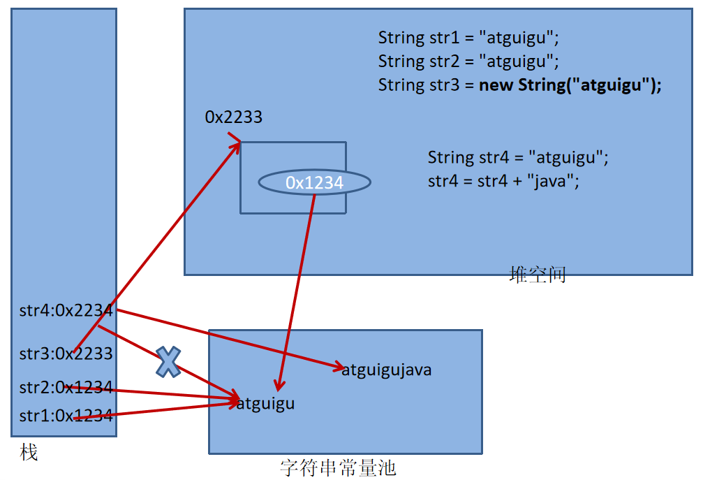
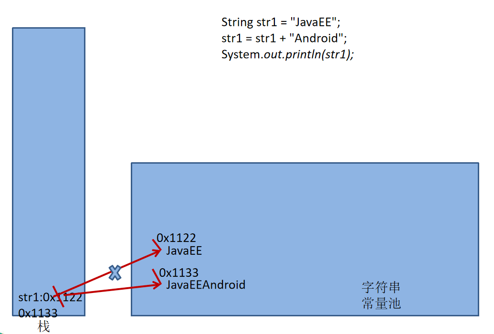
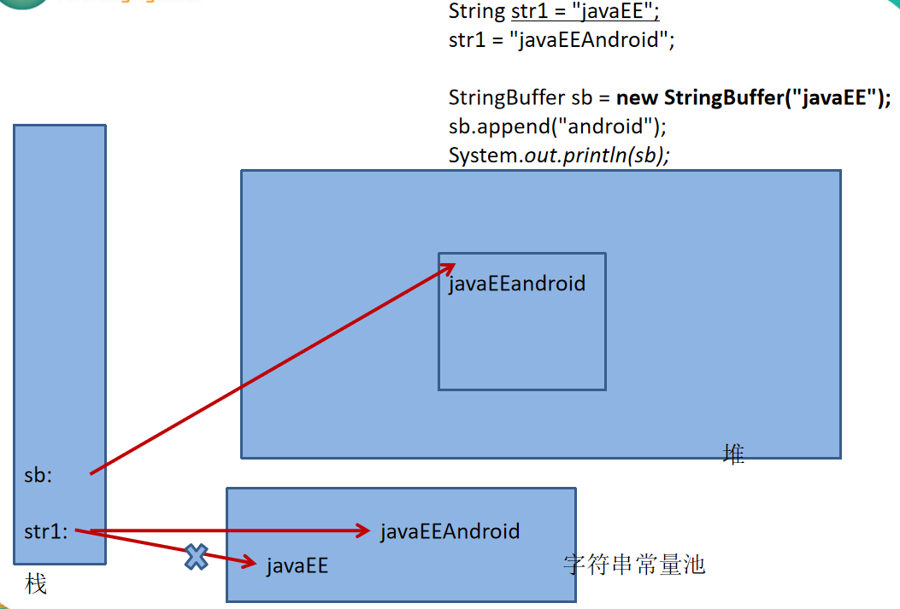
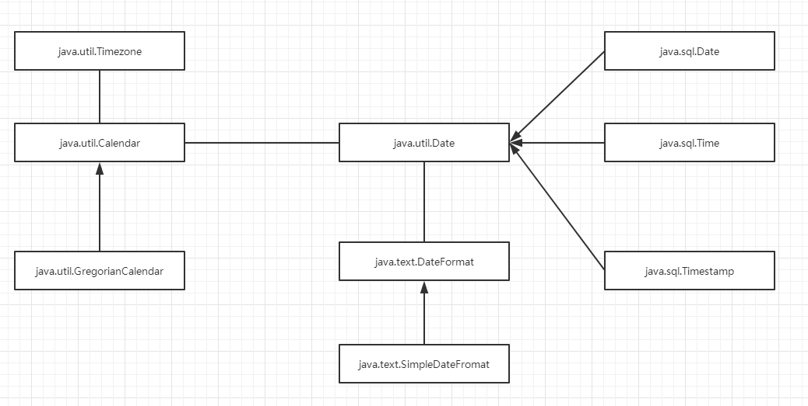

day18 java常用类
==


## 1. String类

作用：构造字符对象
* 常量对象: 字符串常量对象是双引号括起来的字符序列
* 字符串的字符使用unicode字符编码，一个字符占两个字节**(即1 char 占用 2 byte)**


### 字符串的特性

* String是一个final类，字符串是不可变的字符序列
* 字符串是不可变的。一个字符串对象一旦被创建，其内容是不可变的


### String类的构造器

```java
String()
String(String original)
String(byte[] bytes) 使用运行JVM平台的默认字符集编码字节数组bytes，可用于byte[]字节数组转字符串
String(byte[] bytes, Charset charset) 使用指定的字符集charset来解码字节数组bytes
String(byte[] bytes, int offset, int length)
String(byte[] bytes, int offset, int length, Charset charset)
String(char[] value) 字符数组转字符串
String(char[] value, int offset, int count)
String(byte[] ascii, int hibyte)    Deprecated
String(byte[] ascii, int hibyte, int offset, int count) //Deprecated
String(byte[] bytes, int offset, int length, String charsetName)
String(int[] codePoints, int offset, int count)
String(StringBuffer buffer)
String(StringBuilder builder)
```


### String对象内存结构  

  
  
  


### String方法

字符串是不可变的，所以操作字符串时，返回字符串时都是一个新的对象，原来的字符串对象不变

```java
char charAt(int index) 返回索引为index的字符
boolean endsWith(String suffix) 当前字符串是否以字符串suffix结尾
byte[] getBytes() 把当前字符串使用平台默认字符集编码成一个新的字节数组并返回
byte[] getBytes(Charset charset) 使用指定的charset字符集把当前字符串编码成一个新的字节数组并返回
byte[] getBytes(String charsetName) 把当前字符串使用指定的字符集编码成一个新的字节数组并返回
boolean equals(Object anObject)
boolean equalsIgnoreCase(String anotherString) 忽略大小写的方式比价两个字符串是否相等
int indexOf(int ch) 回该字符串中指定字符ch第一次出现的索引
int indexOf(int ch, int fromIndex) 返回指定字符第一次出现的字符串中的索引，从指定索引fromIndex开始搜索。
int indexOf(String str) 返回子字符串str在当前字符串中首次出现的索引值
int indexOf(String str, int fromIndex) 返回子字符串str在当前字符串中首次出现的索引值，从指定索引fromIndex开始搜索。
String intern() 返回字符串对象的规范表示形式。
boolean isEmpty() 这个字符串长度是否为0
int length() 返回当前字符串的长度
int lastIndexOf(int ch) 返回指定编码值为ch的字符在当前字符串中最后一次出现的索索引值，不存在则返回-1
int lastIndexOf(int ch, int fromIndex) 返回指定编码值为ch的字符在当前字符串中最后一次出现的索索引值，从指定的索引位置fromIndex开始搜索
int lastIndexOf(String str) 返回指定子字符串最后一次出现的字符串中的索引
int lastIndexOf(String str, int fromIndex) 返回指定子字符串最后一次出现的字符串中的索引，从指定的索引位置fromIndex开始搜索
String trim() 返回当前字符串去掉收尾两端的所有的空格后的新字符串，当前字符串不改变
String strip() 去除首尾的空格
String stripLeading() 去除首部的空位
String stripTrailing() 去除尾部的空格
String substring(int beginIndex) 返回从beginIndex到末尾的字串
String substring(int beginIndex, int endIndex) 返回索引为[beginIndex, endIndex)的子串
char[] toCharArray() 把当前字符串转换成一个字符数组并返回
String toLowerCase()  使用默认规则吧所有字符都转换成小写字符
String replace(char oldChar, char newChar) 使用字符newChar替换字符oldChar
String replace(CharSequence target, CharSequence replacement) 使用字符串replacement替换替换目标字符序列target
String replaceAll(String regex, String replacement) 使用字符串replacement替换正则表达式regex匹配的所有结果。
String replaceFirst(String regex, String replacement) 使用字符串replacement替换正则表达式regex匹配的第一个子串。
String[] split(String regex) 使用正则表达式regex分割当前字符串，分割结果以String[]返回
String[] split(String regex, int limit) 使用正则表达式regex分割当前字符串，最多分割limit次，分割结果以String[]返回
boolean startsWith(String prefix) 当前字符串是否已子字符串prefix开始
boolean startsWith(String prefix, int toffset) 从索引为toffset位置开始是否以子字符串prefix开始
int compareTo(String anotherString) 从词法上比较两个字符串
int compareToIgnoreCase(String str) 忽略大小写，从词法上比较两个字符串
static String join(CharSequence delimiter, CharSequence... elements) 使用指定的分隔符delimiter连接多个元素elements组成的新字符串，并返回
static String join(CharSequence delimiter, Iterable<? extends CharSequence> elements) 使用指定的分隔符delimiter连接可迭代的集合元素，并返回


int codePointAt(int index) 返回指定索引位置为index处的int型字符Unicode编码值，
int codePointCount(int beginIndex, int endIndex)
String concat(String str) 将指定的字符串连接到此字符串的结尾
boolean contains(CharSequence s) 当前字符是否包含子字符串s
boolean contentEquals(CharSequence cs) 比较当前字符串与指定的cs字符串是否相等
boolean contentEquals(StringBuffer sb) 比较当前字符串与指定的sb字符缓冲串是否相等
static String copyValueOf(char[] data) 相当于 String.valueOf(char[])
static String copyValueOf(char[] data, int offset, int count)  相当于String.valueOf(char[], int offset, int count)
static String format(Local l, String format, Object... args)
static String format(String format, Object... args)
void getBytes(int srcBegin, int srcEnd, byte[] dst, int dstBegin)
void getChars(int srcBegin, int srcEnd, char[] dst, int dstBegin) 将此字符串中[srcBegin, srcEnd)的字符复制到目标字符数组dst中，且开始位置为dstBegin
int hashCode()
boolean matches(String regex) 测试当前字符串与给定的正则表达式regex是否匹配
int offsetByCodePoints(int index, int codePointOffset) 返回指定的字节编码为codePointOffset在当前字符串中的索引与给定的索引index的差值
boolean regionMatches(boolean ignoreCase, int toffset, String other, int ooffset, int len)
boolean regionMatches(int toffset, String other, int ooffset, int len)
CharSequence subSequence(int beginIndex, int endIndex) 返回索引为[beginIndex, endIndex)的子字符序列
String toLowerCase(Locale locale)
String toString()
String toUpperCase() 所有字符都转换成大写
String toUpperCase(Locale locale) 使用给定区域设置的规则locale将此字符串中的所有字符转换为大写
static String valueOf(boolean b) boolean型转成字符串
static String valueOf(char c)
static String valueOf(char[] data)
static String valueOf(char[] data, int offset, int count)
static String valueOf(double d)
static String valueOf(float f)
static String valueOf(int i)
static String valueOf(long l)
static String valueOf(Object obj)
```


### String的hashCode()方法

```text
S = s[0]*31^(n-1) + s[1]*31^(n-2) + ... + s[n-1]
n: 字符串长度
s[x]: 表示一个字符

// StringLatin1类（用一个字节来表示一个拉丁字符）
    public static int hashCode(byte[] value) {
        int h = 0;
        for (byte v : value) {
            h = 31 * h + (v & 0xff);
        }
        return h;
    }
    
// StringUTF16类（用两个字节来表示一个非拉丁的字符）
    public static int hashCode(byte[] value) {
        int h = 0;
        int length = value.length >> 1; // 左位移一位，等价除以2。这步是计算字符的个数
        for (int i = 0; i < length; i++) {
            h = 31 * h + getChar(value, i);
        }
        return h;
    }

```


### 基本数据类型, 包装类之间转换

* 字符串 -> 基本数据类型、包装类：调用 相应包装类.parseXxx(String str)   其中Xxx为相应的基本数据类型
* 基本数据类型、包装类 -> 字符串：调用String.valueOf(T obj)  // T 为int、boolean、byte等基本数据类型


### 字节数组的相互转换

* 字符串 -> 字节数组：字符串对象.getBytes()
    
    >public byte[] getBytes(String charsetName) 使用参数指定字符编码，将当前字符串转化为一个字节数组
* 字节数组 -> 字符串：new String(byte[] b)
    
    >String(byte[]，int offset，int length)


### 字符数组的相互转换

* 字符串 -> 字符数组：
    * 字符串对象.toCharArray()
    * String.getChars(int srcBegin, int srcEnd, char[] dst, int dstBegin)
    ```java
    char[] ch = new char[s.length()];
    s.getChars(0, s.length(), ch, 0);
    ```
    
* 字符数组 -> 字符串
    
    ```java
    new String(char[] ch)
    String(char[]，int offset，int length)
    ```


# 2. StringBuffer

位于java.lang.StringBuffer  

* StringBuffer对象是 可变的字符序列，可以对字符串内容进行增删改
* 很多方法与String相同，StringBuffer对象长度可变
* StringBuffer是一个容器

### 构造器
```java
StringBuffer() 新建一个空的字符串缓冲区，容量大小为16
StringBuffer(CharSequence seq) 构造一个字符串缓冲区，该缓冲区包含与指定字符序列相同的字符
StringBuffer(int capacity) 构建一个空字符串缓冲区，初始容量为指定的capacity
StringBuffer(String str) 新建一个字符串缓冲区，内容为指定字符串str

CharSequence类是java.lang包下的一个接口，此接口对多种不同的对char访问的统一接口，像String、StringBuffer、StringBuilder类都是CharSequence的子接口；
```

### StringBuffer对象内存结构  

  


## StringBuffer方法
```java
//增
StringBuffer append(T obj)  T为基本数据类型、字符串、字符数据等所有的Object
StringBuffer insert(int offset, T obj) 在当前序列指定索引offset插入obj对象，obj为任意类型的对象

//删
StringBuffer delete(int start, int end) 删除此序列中索引为[start, end)的字符
StringBuffer deleteCharAt(int index) 删除此序列中索引为index的字符

//改
void setCharAt(int index, char ch) 把索引为index处的字符重置为字符ch
StringBuffer replace(int start, int end, String str) 把此序列中索引为[start, end)替换为字符串str

//查
char charAt(int index) 返回索引为index的字符
CharSequence subSequence(int start, int end) 获取索引为[start, end)的字符序列
String substring(int start) 获取此序列中索引从start开始到结束的子序列
String substring(int start, int end) 获取此序列中索引[start, end)的子序列
void getChars(int srcBegin, int srcEnd, char[] dst, int dstBegin) 把此序列中索引为[srcBegin, srcEnd)的字符复制到到目标字符数组dst，从索引为dstBegin开始存

//其他
int capacity() 返回当前的容量大小
int length() 返回序列内容长度
StringBuffer reverse() 反转当前序列内容，并返回当前序列
void trimToSize() 试图减少用于字符序列的存储空间，删除未使用容量
int indexOf(String str) 返回字符串str在此字符中首次出现的索引值
int indexOf(String str, int fromIndex) 返回字符串str在此字符中首次出现的索引值，从索引fromIndex开始查找
int lastIndexOf(String str) 返回字符串str在此字符中首最后一次出现的索引值
int lastIndexOf(String str, int fromIndex) 返回字符串str在此字符中首最后一次出现的索引值，从索引fromIndex开始查找


int codePointAt(int index) 返回索引为index的字符的Unicode code指针值
int codePointCount(int beginIndex, int endIndex) 返回此序列指定文本范围内的Unicode代码点数
void ensureCapacity(int minimumCapacity) 确保容量最小为指定的minimumCapacity
int offsetByCodePoints(int index, int codePointOffset) 返回此序列中的索引，该索引与给定索引之间的偏移量由codepointoffset代码点组成。
void setLength(int newLength) 设置字符序列的长度
String toString()
```


## 3. StringBuilder类

JDK 1.5开始有的特性  StringBuilder和StringBuffer非常类似，两者的对象都是可变的字符序列，方法也类似  


### String, StringBuffer, StringBuilder特点比较

* String：不可变字符序列
* StringBuffer：可变字符序列、效率中等、**线程安全**
* StringBuilder：可变字符序列、效率高、**线程不安全**
* String使用缺陷
```java
string s="a"; // 创建了一个字符串 
s=s+"b"; // 实际上原来的"a"字符串对象已经丢弃了，现在又产生了一个字符串s+"b"（也就是"ab")。
         // 如果多次执行这些改变串内容的操作，会导致大量副本字符串对象存留在内存中，降低效率。
         // 如果这样的操作放到循环中，会极大影响程序的性能。

```
* 三者的效率：StringBuilder > StringBuffer > String


## 4. 时间相关的类

* System.currentTimeMillis();
* Date：java.util.Date、java.sql.Date
* SimpleDateFormat
* Calendar



### System.currentTimeMillis()方法
位于java.lang.System。System类提供的public static long currentTimeMillis() 用来返回当前时间与1970-01-01 00:00:00 之间以毫秒为单位的时间差 1000ms = 1s System.currentTimeMillis() 方法适用于计算时间差


### 主要时间标准

* UTC(Universal Time Coordinated)世界标准时间
* GMT(Greenwich Mean Time)格林威治时间
* CST
```java
有4中表示：
Central Standard Time (USA) UTC-6:00 美国时间

Central Standard Time (Australia) UTC+9:30 澳大利亚 

China Standard Time UTC+8:00 北京时间（中国时间）

Cuba Standard Time UTC-4:00 古巴时间

Linux系统中用表示北京时间
```


## 5. Date类

表示特定的瞬间，精确到毫秒  另外还有一个java.sql.Date，这个主要用于数据库相关的

### 构造器
```java
Date() 获取本地当前时间构建一个Date
Date(int year, int month, int date) // Deprecated
Date(int year, int month, int date, int hrs, int min) // Deprecated
Date(int year, int month, int date, int hrs, int min, int sec) // Deprecated
//以上三个构造器以1900-01-01 00:00:00 GMT为基准时间。年为相对于1900年的差值，即偏移量。
//月份从0开始，即month为0表示1月
//如创建 2019-1-2
Date date = new Date(2019- 1900, 1 - 1, 2);

Date(long date) 以1970-01-01 00:00:00 GMT为基准的，毫秒差值
Date(String s) // Deprecated
```

### 方法
```java
boolean after(Date when)
boolean before(Date when)
Object clone()
int compareTo(Date anotherDate)
boolean equals(Object obj)
static Date from(Instant instant)
int getDate() // Deprecated
int getDay() // Deprecated
int getHours() // Deprecated
int getMinutes() // Deprecated
int getMonth() // Deprecated
int getSeconds() // Deprecated
int getTime() 返回自 1970-1-1 00:00:00 GMT 以来此Date对象表示的毫秒数
int getTimezoneOffset()
int getYear() // Deprecated
int hashCode() // Deprecated
static long parse(String s)
void setDate(int date)  // Deprecated
void setHours(int hours) // Deprecated
void setMinutes(int minutes) // Deprecated
void setMonth(int month) // Deprecated
void setSecondes(int secondes) // Deprecated
void setTime(long time)
void setYear(int year) // Deprecated
String toGMTString() // Deprecated
Instant toInstant()
String toLocaleString() // Deprecated
String toString() 把此 Date 对象转换为以下形式的 String： dow mon dd hh:mm:ss zzz yyyy 其中： dow 是一周中的某一天 (Sun, Mon, Tue, Wed, Thu, Fri, Sat)，zzz是时间标准
static long UTC(int year, int month, int date, int hrs, int min, int sec) // Deprecated

## java.sql.Date构造器
Date(int year, int month, int day)  //Deprecated
Date(long date)

## java.sql.Date方法
int getHours() // Deprecated
int getMinutes() // Deprecated
int getSeconds() // Deprecated
void setHours(int i) // Deprecated
void setMinutes(int i) // Deprecated
void setSeconds(int i)  // Deprecated
void setTime(long date) 重置此时间
Instant toInstant()
LocalDate toLocalDate() 把此Date转成本地时间格式
String toString() // Formats a date in the date escape format yyyy-mm-dd.
static Date valueOf(LocalDate date)  从本地时间格式的LocalDate获取Date实例
static Date valueOf(String s) 从字符串中获取Date实例

过时的方法到SimpleDateFormat中找
```


## 6. SimpleDateFormat类

位于java.text.SimpleDateFormat。Date类的API不易于国际化，大部分被废弃了，java.text.SimpleDateFormat类是一个不与语言环境有关的方式来格式化和解析日期的具体类

* 格式化：Date对象 -> 指定格式文本
* 解析：一定格式的文本 -> Date对象

### 构造器
```JAVA
SimpleDateFormat() // 使用默认的本地时间格式构建一个SimpleDateFormat对象
SimpleDateFormat(String pattern) //使用指定的时间格式pattern构建一个SimpleDateFormat对象
SimpleDateFormat(String pattern, DateFormatSymbols formatSymbols)
SimpleDateFormat(String pattern, Locale locale)
```


### pattern定义

字母 | 日期或时间元素 | 表示 | 示例
:--- |:--- |:--- |:--- 
G | Era 公元标识符 | Text | AD
y | year | Year | 1996; 96
Y | Week year | Year | 2009; 09
M | Month in year (context sensitive) | Month | July; Jul; 07
L | Month in year (standalone form) | Month | July; Jul; 07
w | Week in year | Number | 27
W | Week in month | Number | 2
D | Day in year | Number | 189
d | Day in month | Number | 10
F | Day of week in month | Number | 2
E | Day name in week | Text | Tuesday; Tue
u | Day number of week (1 = Monday, ..., 7 = Sunday) | Number | 1
a | Am/pm marker | Text | PM
H | Hour in day (0-23) | Number | 0
k | Hour in day (1-24) | Number | 24
K | Hour in am/pm (0-11) | Number | 0
h | Hour in am/pm (1-12) | Number | 12
m | Minute in hour | Number | 30
s | Second in minute | Number | 55
S | Millisecond | Number | 978
z | Time zone | General time zone | Pacific Standard Time; PST; GMT-08:00
Z | Time zone | RFC 822 time zone | -0800
X | Time zone | ISO 8601 time zone | -08; -0800; -08:00

### 方法
```java
String format(Date date)  把Date对象转成时间字符串，其父类DateFormat类中的方法
StringBuffer format(Object obj, StringBuffer toAppendTo, FieldPosition fieldPosition)
Date parse(String source) 把字符串解析成Date，日期的格式要对应上，以1970, 00:00:00 GMT基准时间
Date parse(String text, ParsePosition pos)

void applyLocalizedPattern(String pattern)
void applyPattern(String pattern)
Object clone()
boolean equals(Object obj)
AttributedCharacterIterator formatToCharacterIterator(Object obj)
Date get2DigitYearStart()
DateFormatSymbols getDateFormatSymbols()
int hashCode()
void set2DigitYearStart(Date startDate)
void setDateFormatSymbols(DateFormatSymbols newFormatSymbols)
String toLocalizedPattern()
String toPattern()

```


## 7. Calendar类

位于java.util.Calendar。Calendar是一个抽象基类，主用用于完成日期字段之间相互操作的功能

获取Calendar实例的方法
* 调用 Calendar.getInstace() 方法
* 调用它的子类 GregorianCalendar 的构造器

一个Calendar的实例是系统时间的抽象表示，通过 get(int field) 方法来获取想要的时间信息。
>比如 YEAR、MONTH、DAY_OF_WEEK、HOUR_OF_DAY、MINUTE、SECOND  
* public void set(int field, int value)
* public void add(int field, int amount)
* public final Date getTime()
* public final void setTime(Date date)

```java
public static final int ERA = 0;
public static final int YEAR = 1;
public static final int MONTH = 2;
public static final int WEEK_OF_YEAR = 3;
public static final int WEEK_OF_MONTH = 4;
public static final int DATE = 5;
public static final int DAY_OF_MONTH = 5;
public static final int DAY_OF_YEAR = 6;
public static final int DAY_OF_WEEK = 7;
public static final int DAY_OF_WEEK_IN_MONTH = 8;
public static final int AM_PM = 9;
public static final int HOUR = 10;
public static final int HOUR_OF_DAY = 11;
public static final int MINUTE = 12;
public static final int SECOND = 13;
public static final int MILLISECOND = 14;
public static final int ZONE_OFFSET = 15;
public static final int DST_OFFSET = 16;
public static final int FIELD_COUNT = 17;

//获取星期时：周日是1、周一是2、周二是3、周三是4、周四是5、周五是6、周六是7
public static final int SUNDAY = 1;
public static final int MONDAY = 2;
public static final int TUESDAY = 3;
public static final int WEDNESDAY = 4;
public static final int THURSDAY = 5;
public static final int FRIDAY = 6;
public static final int SATURDAY = 7;

//获取月份时：1月是0, 2月是1， 依次类推，12月是11
public static final int JANUARY = 0;
public static final int FEBRUARY = 1;
public static final int MARCH = 2;
public static final int APRIL = 3;
public static final int MAY = 4;
public static final int JUNE = 5;
public static final int JULY = 6;
public static final int AUGUST = 7;
public static final int SEPTEMBER = 8;
public static final int OCTOBER = 9;
public static final int NOVEMBER = 10;
public static final int DECEMBER = 11;
public static final int UNDECIMBER = 12;

public static final int AM = 0;
public static final int PM = 1;

```


## 8. Math类

位于java.lang.Math。提供了一系列用于科学计算的方法。

* 不能再继承，final修饰的类
* 不需要实例化，方法都为static静态的

### 常量
public static final double E = 2.7182818284590452354;  
public static final double PI = 3.14159265358979323846;

### Math方法
```java
static T abs(T a) 求绝对值，T为double、float、int、long
static int addExact(int x, int y) 返回传入的两个数的和
static long addExact(long x, long y) 返回传入的两个数的和
static int subtractExact(int x, int y) 返回x - y的差值，即 x - y
static long subtractExact(long x, long y) 返回 x - y
static int multiplyExact(int x, int y) 返回两数的积
static long multiplyExact(long x, long y) 返回两数的积
static int negateExact(int a) 求此数的相反数
static long negateExact(long a) 求此数的相反数
static int floorMod(int x, int y) 取模，返回x % y
static long floorMod(long x, long y) 取模，返回x % y

static double sin(double a) 返回弧度a的正弦值，即sin(a)
static double cos(double a) 求余弦值，即cos(a)
static double tan(double a) 返回弧度a的正切值，即tan(a)
static double asin(double a) 返回反正弦值，值范围：[-pi/2, pi/2]
static double acos(double a) 返回反余弦值，值范围：[0, pi]
static double atan(double a) 返回反正切值，值范围：(-pi/2, pi/2)
static double atan2(double y, double x) 返回从直角坐标(x，y)到极坐标(r，θ)的转换角度θ

static double sinh(double x) 返回x的双曲正弦值
static double cosh(double x) 求返回双曲余弦值，即cosh(x)
static double tanh(double x) 返回x的双曲正切值，即tanh(x)

static double toDegrees(double angrad) 弧度转换成角度(近似值)
static double toRadians(double angdeg) 角度转换成弧度(近似值)

static double cbrt(double a) 求立方根

static T max(T a, T b) T为double、float、int、long 求两数的最大值
static T min(T a, T b) T为double、float、int、long 求两数的最小值

static double sqrt(double a) 返回双精度数a的平方根，即a^(1/2)
static double pow(double a, double b) 返回a的b次幂，即a^b
static double exp(double a) 返回欧拉数e的幂，即e^a
static double random() 返回[0.0, 1.0)范围内随机的一个双精度浮点数

static double log(double a) 求此值的自然对数，以e为底
static double log10(double a) 求此值的以10为底的对数

static int decrementExact(int a) 减1，返回 a - 1
static long decrementExact(long a) 减1，返回 a - 1
static int incrementExact(int a) 加1，返回 a + 1
static long incrementExact(long a) 加1，返回 a + 1

static double expm1(double x) 返回欧拉数 e^x - 1
static double ceil(double a) 天花整，上取整(返回double型的整数)
static double floor(double a) 地板整，下取整(返回double型的整数)
static int floorDiv(int x, int y) 返回两数相除的商下取整
static long floorDiv(long x, long y) 返回两数相除的商下取整

static double copySign(double magnitude, double sign)
static float copySign(float magnitude, float sign)
static int getExponent(double d) 求指定数的无偏质数
static int getExponent(float f) 求指定数的无偏质数
static double hypot(double x, double y) 求两数平方的和开平方，即 (x^2 + y^2)^(1/2)，类似已知直角三角形直角边长度，求斜边
static double IEEEremainder(double f1, double f2) 按照IEEE754标准，计算两个数的余数
static double log1p(double x) 此值的以10为底的对数，返回此对数+1的和
static double nextAfter(double start, double direction) 返回与start相近的浮点数，精度为系统最大精度，方向与direction靠近。
static float nextAfter(float start, double direction)
static double nextDown(double d) 返回沿负无穷大方向与d相邻的浮点数
static float nextDown(float f)
static double nextUp(double d) 返回沿正无穷大方向与d相邻的浮点数
static float nextUp(float f)
static double rint(double a) 返回最接近浮点数a的整数的双精度值，以四舍五入原则，精确到个位。如 Math.rint(3.5) -> 4.0
static long round(double a) 取最接近小数a的长整型数，取值方向为正无穷大，以四舍五入原则处理
static int round(float a) 取最接近小数a的整型数，取值方向为正无穷大，以四舍五入原则处理
static double scalb(double d, int scaleFactor) 返回小数d 乘以 2的scaleFactor次幂的积，即 d * 2^scaleFactor
static float scalb(float f, int scaleFactor)
static double signum(double d) 返回数d的符号，
                                0.0：d = 0
                                1.0：d > 0
                                -1.0：d < 0
static float signum(float f) 返回数d的符号,
                                0.0F：d = 0
                                1.0F：d > 0
                                -1.0F：d < 0
static int toIntExact(long value) 返回long型数转int的值，即(int) value
static double ulp(double d) 返回数d的精度值
static float ulp(float f)


// 浮点 Math 方法的准确性根据 ulp（units in the last place，最后一位的进退位）来衡量
An ulp stands for unit of least precision 一个ulp表示最小精度单位, https://www.geeksforgeeks.org/java-math-ulp-method-examples/

```


## 9. BigInteger类

Integer类是int的包装类，能存储的最大整型值为2^31 - 1。BitInteger类的数字范围比Integer类的数字范围要大的多，可以支持任意精度的整数。**整数范围超过2^31 - 1，科学研究计算**


### 构造器

```java
BigInteger(String val)
BigInteger(byte[] val)
BigInteger(int signum, byte[] magnitude)
BigInteger(int bitLength, int certainty, Random rnd)
BigInteger(int numBits, Random rnd)
BigInteger(String val, int radix)
```


### 常量

```java
static BigInteger ONE
static BigInteger TEN
static BigInteger ZERO
```


### 方法

```java
BigInteger abs() 返回绝对值
BigInteger add(BigInteger val) 返回 this + val
BigInteger subtract(BigInteger val) 返回 this - val
BigInteger multiply(BigInteger val) 返回 this * val
BigInteger divide(BigInteger val) 返回 this / val

BigInteger and(BigInteger val) 返回 this & val
BigInteger or(BigInteger val) 或运算，返回 (this | val)
BigInteger not() 取反，返回~this
BigInteger xor(BigInteger val) 异或运算，返回 this ^ val
BigInteger andNot(BigInteger val) 返回 this & ~val
BigInteger shiftLeft(int n) this << n
BigInteger shiftRight(int n) this >> n

BigInteger max(BigInteger val) 返回 this 与 val中较大的值
BigInteger min(BigInteger val) 返回 this 与 val中较小的值
BigInteger mod(BigInteger m) 返回 this % m
BigInteger modInverse(BigInteger m) 返回 this^(-1) % m
BigInteger modPow(BigInteger exponent, BigInteger m) 返回 this^exponent % m
BigInteger pow(int exponent) 返回 this^exponent
BigInteger remainder(BigInteger val) 返回 this % val

int bitCount() 返回这个大整数的二进制补码表示中与其符号位不同的位数
int bitLength() 返回这个大整数的最小二进制补码表示中的位数，不包括符号位
byte byteValueExact() 将这个大整数转换为byte，检查丢失的信息
BigInteger clearBit(int n)
int compareTo(BigInteger val)
BigInteger[] divideAndRemainder(BigInteger val) 返回 BigInteger[]{ this / val, this % val }
double doubleValue() 把此BigInteger转化成 double
boolean equals(Object x)
BigInteger flipBit(int n)
float floatValue()
BigInteger gcd(BigInteger val)
int getLowestSetBit()
int hashCode()
int intValue()
int intValueExact()
boolean isProbablePrime(int certainty)
long longValue()
long longValueExact()
BigInteger negate()
BigInteger nextProbablePrime()
static BigInteger probablePrime(int bitLength, Random rnd)

BigInteger setBit(int n)
short shortValueExact()
int signum()
boolean testBit(int n)
byte[] toByteArray()
String toString()
String toString(int radix)
static BigInteger valueOf(long val)
```


## 10. BigDecimal类

一般的Float类和Double类可以用来做科学计算或工程计算，但在商业计算中，要求数字精度比较高，故用到java.math.BigDecimal类。BigDecimal类支持任何精度的定点数。遇到和钱有关的数据，对精度有要求的，必须使用BigDecimal类


### 类构造器
```java
BigDecimal(BigInteger val)
BigDecimal(BigInteger unscaledVal, int scale)
BigDecimal(BigInteger unscaledVal, int scale, MathContext mc)
BigDecimal(BigInteger val, MathContext mc)
BigDecimal(char[] in)
BigDecimal(char[] in, int offset, int len)
BigDecimal(char[] in, int offset, int len, MathContext mc)
BigDecimal(char[] in, MathContext mc)
BigDecimal(double val) // 会出现丢失进度的问题
BigDecimal(double val, MathContext mc)
BigDecimal(int val)
BigDecimal(int val, MathContext mc)
BigDecimal(long val)
BigDecimal(long val, MathContext mc)
BigDecimal(String val)  // 不会丢失精度，适用于float, double类型的数据，建议使用 new BigDecimal(String val) 新建对象
BigDecimal(String val, MathContext mc)

```


### 类常量

```java
static BigDecimal ONE  // 1
static BigDecimal TEN  // 10
static BigDecimal ZERO  // 0
static int ROUND_CEILING
static int ROUND_DOWN
static int ROUND_FLOOR
static int ROUND_HALF_DOWN
static int ROUND_HALF_EVEN
static int ROUND_HALF_UP
static int ROUND_UNNECESSARY
static int ROUND_UP

```

### 方法
```java
BigDecimal abs()
BigDecimal abs(MathContext mc)
BigDecimal add(BigDecimal augend)
BigDecimal add(BigDecimal augend, MathContext m
byte byteValueExact()
int compareTo(BigDecimal val)
BigDecimal divide(BigDecimal divisor)
BigDecimal divide(BigDecimal divisor, int roundingMode)
BigDecimal divide(BigDecimal divisor, int scale, int roundingMode)
BigDecimal divide(BigDecimal divisor, int scale, RoundingMode roundingMode)
BigDecimal divide(BigDecimal divisor, MathContext mc)
BigDecimal divide(BigDecimal divisor, RoundingMode roundingMode)
BigDecimal divideAndRemainder(BigDecimal divisor)
BigDecimal divideAndRemainder(BigDecimal divisor, MathContext mc)
BigDecimal divideToIntegralValue(BigDecimal divisor)
BigDecimal divideToIntegralValue(BigDecimal divisor, MathContext mc)
double doubleValue()
boolean equals(Object x)
float floatValue()
int hashCode()
int intValue()
int intValueExact()
long longValue()
BigDecimal max(BigDecimal val)
BigDecimal min(BigDecimal val)
BigDecimal movePointLeft(int n)
BigDecimal movePointRight(int n)
BigDecimal multiply(BigDecimal multiplicand)
BigDecimal multiply(BigDecimal multiplicand, MathContext mc)
BigDecimal negate()
BigDecimal negate(MathContext mc)
BigDecimal plus()
BigDecimal plus(MathContext mc)
BigDecimal pow(int n)
BigDecimal pow(int n, MathContext mc)
int precision()
BigDecimal remainder(BigDecimal divisor)
BigDecimal remainder(BigDecimal divisor, MathContext mc)
BigDecimal round(MathContext mc)
int scale()
BigDecimal scaleByPowerOfTen(int n)
BigDecimal setScale(int newScale)
BigDecimal setScale(int newScale, int roundingMode)
BigDecimal setScale(int newScale, RoundingMode roundingMode)
short shortValueExact()
int signum()
BigDecimal stripTrailingZeros()
BigDecimal subtract(BigDecimal subtrahend)
BigDecimal subtract(BigDecimal subtrahend, MathContext mc)
BigInteger toBigInteger()
BigInteger toBigIntegerExact()
String toEngineeringString()
String toPlainString()
String toString()
BigDecimal  ulp()
BigInteger unscaledValue()
static BigDecimal valueOf(double val)  // double类型的数据转成BigDecimal，不会丢失精度，实际调用了new BigDecimal(Double.toString(val));方法
static BigDecimal valueOf(long val)
static BigDecimal valueOf(long unscaledVal, int scale)

```
### 精度丢失避免方法
```JAVA
new BigDecimal(String val);
BigDecimal.valueOf(double val);
```


## 11. Scanner类

### next()

* 一定要读取到有效字符后才可以结束输入。以空格、回车、Tab键都会视为结束符。
* 对输入有效字符之前遇到的空白，next() 方法会自动将其去掉。
* 只有输入有效字符后才将其后面输入的空白作为分隔符或者结束符。
* next()不能得到带有空格的字符串。

### nextLine()

* 以Enter(\n)为结束符,也就是说 nextLine()方法返回的是输入回车之前的所有字符。