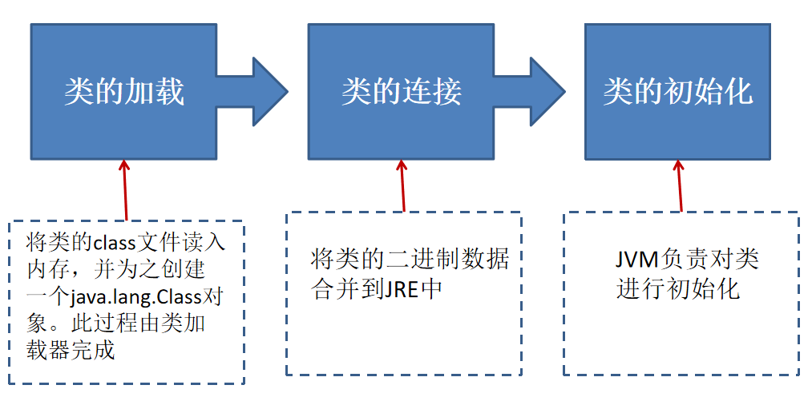
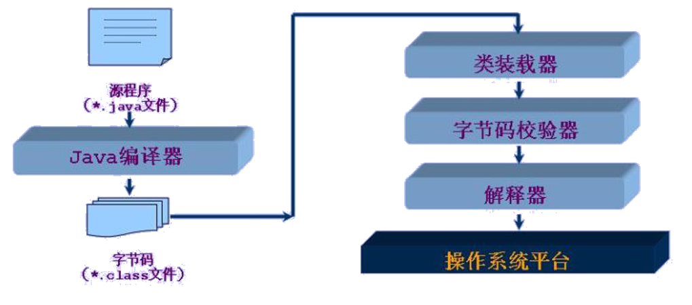
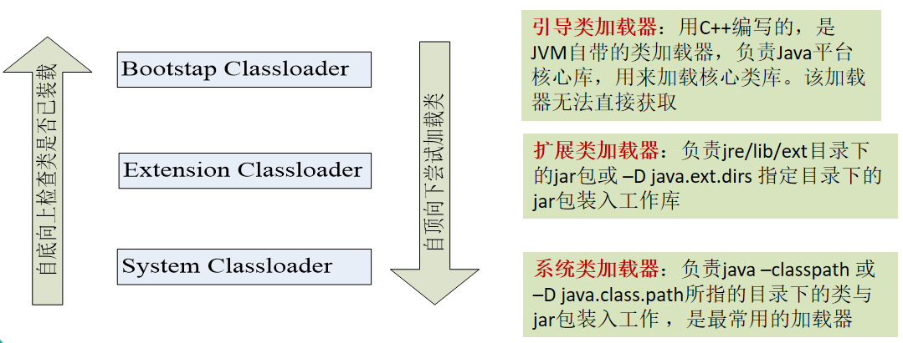

day19 反射机制
==


## 1. 反射

reflection被视为动态语言的关键，反射机制允许程序员在执行期间借助于reflection API。取得任何类的内部信息，并能直接操作任意对象的内部属性, 方法


### 反射机制提供的功能

在运行时判断任意一个对象所属的类

在运行时构造任意一个类的对象

在运行时判断任意一个类所具有的成员变量和方法

在运行时调用任意一个对象的成员变量和方法

生成动态代理


### 反射相关的主要API

java.lang.Class 一个类

java.lang.reflect.Method 类的方法

java.lang.reflect.Field 类的成员变量

java.lang.reflect.Constructor 类的构造器


### Class类

Object 类是所有类的根类，Object定义了下面这个方法

>public final Class getClass()

Class类是java反射的源头

正常方式

>引入需要的"包类"名称 -> 通过 new实例化 -> 取得实例化的对象

反射方式

>实例化对象 -> 对象.getClass() -> 得到完整的"包类"名称

Class也是一个类, Class对象只能有系统创建对象

**一个类在JVM中有且只有一个Class实例**

一个Class对象对应的是一个加载到JVM中的一个.class文件

每个类的实例都会记录自己是有哪个Class实例生成的

通过Class可以完整的得到一个类的完整结构


#### Class类主要方法

```JAVA
static Class forName(String name) //返回指定类名name的Class对象
Object newInstance() //调用空参(或缺省)的构造器，返回Class对象的一个实例
String getName() //返回此Class对象所表示的实体名称(类、接口、数组、基本类型或void)
Class getSuperClass() //返回此Class对象的父类的Class对象
ClassLoader getClassLoader() //返回此类的加载器
Constructor[] getConstructors() //返回此对象对应类的所有构造器，以数组形式返回
Field[] getDeclaredFields() //返回此对象对应类的声明的属性，Field[]
Method getMethod(String name, Class... paramTypes) //返回此对象对象类形参为paramTypes 的方法
```


#### 获取Class实例的方法
通过运行时类的对象，调用 对象.getClass()

```java
Person p1 = new Person();
// 获取对象的运行时类
Class clazz = p1.getClass();
```
通过运行时类，调用 类.class

```JAVA
Class<String> clazz2 = String.class;
```

通过Class的静态方法，调用 public Class Class.forName(String className),className必须是完整路径的

```JAVA
String className = "com.java.www.Person";
Class clazz3 = Class.forName(className);
```
类加载器

```JAVA
ClassLoader loader = this.getClass().getClassLoader();
Class clazz5 = loader.loadClass("java.lang.Math");
```


## 2. 类加载过程

当程序主动使用某个类时，如果该类还未被加载到内存中，则系统会通过如下三个步骤来对该类进行初始化。

  
  

### ClassLoader
类加载器是用来把类(class)装载进内存的。JVM规范定义了两种类型的类加载器：启动类加载器(bootstrap)和
用户自定义加载器(user-define class loader)。JVM在运行时回产生3个类加载器组成的初始化加载器层次结构，如下：

+ Bootstrap ClassLoader 引导类加载器：用C++编写，是JVM自带的类加载器，负责java平台核心库，用来加载核心类库。访加载器无法直接获取
+ Extension ClassLoader 扩展类加载器：负责jre/lib/ext 目录下的jar包或-D java.ext.dirs指定目录下的jar包载入工作库  
+ System ClassLoader 系统类加载器：负责java -classpath 或 -D java.class.path所指定的目录下的类与jar包载入工作，最常用的加载器  

  


## 3. 类的完整结构

Field、Method、Constructor、Supperclass、实现的Interface、Annotation、方法的Exception信息、内部类。先获取类的Class实例


### 获取实现的接口

```java
public Class<?>[] getInterfaces()
// 获取此对象所表示的类或接口实现的接口
```


### 获取所继承的父类

```java
public Class<? Super T> getSuperclass()
// 返回此Class所表示的实体(类、接口、基本数据类型)的父类的Class
```


### 获取全部的构造器

```java
public Constructor<T>[] getConstructors()
//返回此Class对象所表示的类的所有public构造器

public Constructor<T>[] getDeclaredConstructors()
// 返回此Class对象表示的类中声明的所有构造器，包括私有的
  
//取得修饰符
public int getModifiers()

//取得方法名称
public String getName()

//取得参数的类型
public Class<?>[] getParameterTypes()
```


### 获取全部的方法

```java
// 返回此Class对象所表示的类或接口的全部方法
public Method[] getDeclaredMethods()

//返回此Class对象所表示的类或接口的public方法
public Method[] getMethods()

// 取得方法全部的返回值
public Class<?> getReturnType()
  
//  获取方法全部的参数  
public Class<?>[] getParameterTypes()

// 取得方法修饰符  
public int getModifiers() 
  
//获取方法异常信息    
public Class<?>[] getExceptionTypes() 
```


### 获取全部的属性

```java
public Field[] getFields()
public Field[] getDeclaredFields()

// 以整数形式返回此Field的修饰符
public int getModifiers() 

// 返回Field的属性类型
public Class<?> getType() 

// 返回Field名称  
public String getName() 
```


### 获取注解

```JAVA
public Annotation[] getAnnotations()

public Annotation[] getDeclaredAnnotations()
```


### 泛型相关

```JAVA
Class clazz = Person.class;
Type type1 = clazz.getGenericSuperclass();
ParameterizedType parameterizedType = (ParameterizedType) type1;
Type[] args = parameterizedType.getActualTypeArguments(); //获取实际的泛型类型参数数组
Class firstArg = (Class) args[0];
System.out.println(firstArg.getName());
```


### 获取类所在的包

```JAVA
public Package getPackage()
```


### 获取内部类

```JAVA
public Class[] getDeclaredClasses()
```


### 调用指定的方法

通过Class类的getMethod(String name, Class... parameterTypes) 方法获得一个Method对象，并设置此方法操作是需要的参数

再使用Object invoke(Object obj, Object[] args) 进行调用，并向方法中传递要设置的obj对象的参数信息

* Object对应原方法的返回值，若原方法无返回值，此时返回null
* **若原方法为static静态方法，此时形参Object obj可为null**
* 若原方法形参列表为空，则Object[] args 为null, 可比传此参数
* **若原方法权限修饰符为private，则需要在调用invoke()方法前，显式的调用方法对象的setAccessible(true)方法**，这样就能访问private的方法了，其他的构造、属性等也是类似的


### 调用指定的属性

```JAVA
// Field中：
public Object get(Object obj) 获取指定对象obj上此Field的属性内容
public void set(Object, Object value) 设置指定对象obj上此Field的属性内容值  
```


## 4. 动态代理

动态代理是指客户通过代理类来调用其它对象的方法，并且是在程序运行时根据需要动态创建目标类的代理对象


### 使用场景

* 调试
* 远程方法调用


### 原理

使用一个代理将对象包装起来, 然后用该代理对象取代原始对象. 任何对原始对象的调用都要通过代理. 代理对象决定是否以及何时将方法调用转到原始对象

Proxy：专门完成代理的操作类，是所有动态代理的父类。通过此类为一个或多个接口动态地生成实现类

提供用于创建动态代理类和动态代理对象的静态方法
```JAVA
// 创建一个动态代理类序所对应的Class对象
static Class<?> getProxyClass(ClassLoader loader, Class<?>... interfaces)

// 直接创建一个动态代理对象
static Object newProxyInstance(ClassLoader loader, Class<?>[] interfaces, InvocationHandler h) 
```


### 动态代理步骤

**创建一个实现接口InvocationHandler的类**，它必须实现invoke方法，以完成代理的具体操作

```JAVA
class MyInvocationHandler implements InvocationHandler 

  @Override
  public Object invoke(Object proxy, Method method, Object[] args) throws Throwable {
      // 当通过代理类的对象发起对被重写方法的调用时，都会转为对invoke方法的调用

      Object returnVal = method.invoke(obj, args);
      System.out.println("实现的invoke方法被调用了");
      return returnVal;
  }
}
```
**创建接口**

```JAVA
// 示例
interface Factory {
    void make();
}
```
**创建代理类**

```java
class HuaweiFactory implements Factory {

    @Override
    public void make() {
        System.out.println("华为松山湖生产基地生产了100000 部手机");
    }
}
```

**通过Proxy的静态方法创建相应的接口代理**

```JAVA
public Object getProxyInstance(Object obj) {

    this.obj = obj;
    // 使用反射，根据被代理类动态生成代理对象
    Object proxy = Proxy.newProxyInstance(obj.getClass().getClassLoader(), obj.getClass().getInterfaces(), this);
    return proxy;
}

```
通过代理调用被代理类的方法

```JAVA
// 1. 创建被代理类对象
HuaweiFactory huawei = new HuaweiFactory();
// 2. 创建一个 实现了 InvocationHandler接口的对象
MyInvocationHandler handler = new MyInvocationHandler();

// 调用getProxy获取 动态生成代理类对象
Object obj = handler.getProxyInstance(huawei);
Factory haproxy = (Factory) obj;
haproxy.make(); // 转到对动态代理类对象的invoke()方法的调用
System.out.println();
```

