java 9新特性
==


## 1. 新特性概览

java 9 发布于2017-9-21, java 9 提供了超过150项新功能特性，
包括备受期待的

+ 模块化系统
+ 可交互的 REPL 工具：jshell
+ JDK 编译工具
+ Java 公共 API 和私有代码,以及安全增强、扩展提升、性能管理改善等。


## 2. JDK和JRE的改变

  

**JDK9目录结构**

+ **bin**: 包含所有命令。**在windows平台上，它继续包含了系统的运行时动态链接库**
+ **conf**: 包含用户可编辑的配置文件，例如以前位于jre/lib目录中的.properties和.policy文件和**jdk源码**
+ **include**: 包含编译本地代码使用的C/C+=头文件。它只存在于JDK中
+ **jmods**: 包含JMOD格式的平台模块。创建自定义运行时映像时需要它。它只存在于JDK中
+ **legal**: 包含法律声明
+ **lib**: **包含非windows平台上的动态链接本地库**。其子目录和文件不应由开发员直接编辑或使用


## 3. 模块化系统
Jigsaw项目后改名为Modularity，目的让java模块独立、化繁为简模块化，使代码组织上更安全，因为它可以指定哪些部分可以暴露，其他部分隐藏。模块(module)，本质就是在package外在包一层

### 模块使用示例
module有：core、main、pages

+ core模块下的包com.java.www 暴露给外部调用，
+ pages模块中能访问到core模块下的包com.java.www下的Person类

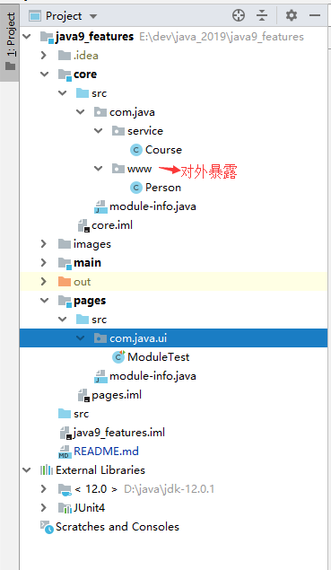  

**默认情况下，每个模块都只能访问到本模块下的类、接口等，无法跨模块去访问**  
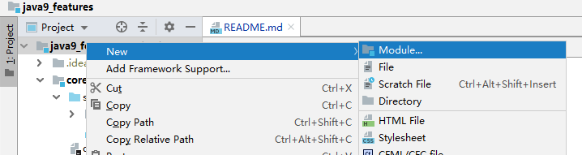  

在每个模块下创建module-info.java文件
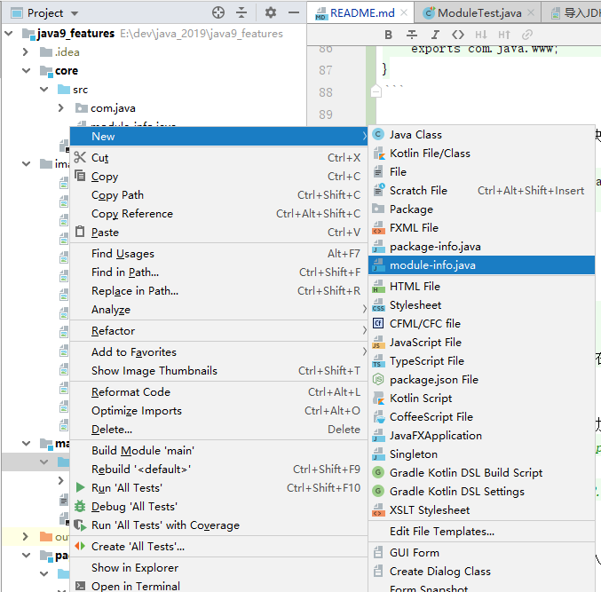  

设置模块core下的com.java.www包导出

```java
module core {
    // 导出包
    exports com.java.www;
}
```

设置模块pages中导入需要的模块

```java
module pages {
    // 导入模块
    requires core; // 光标放这在这行，Alt + Enter键，选择Add dependency on module 'xxx'
}
```
注意添加了这行内容后，要执行添加依赖模块操作，执行后的变化
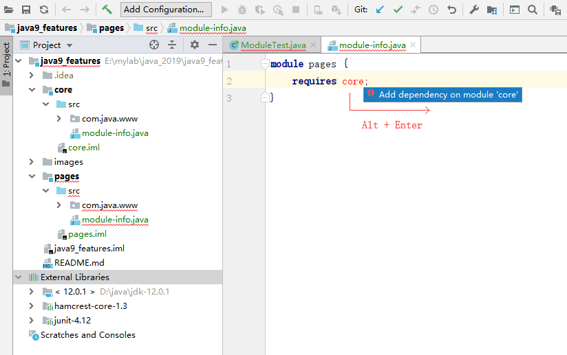  

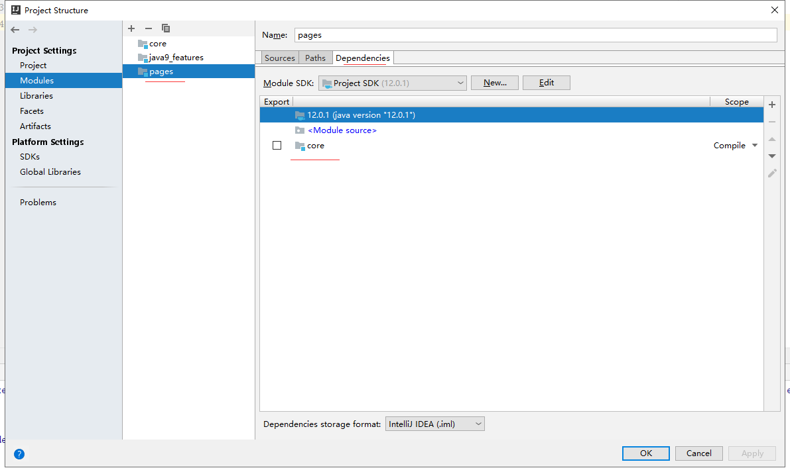  


### 导入JKD内部的模块
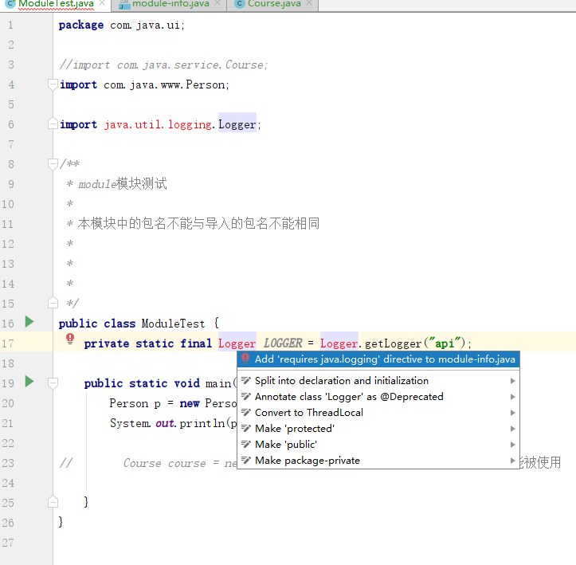  

此时在相应的module-info.java文件中自动添加了配置
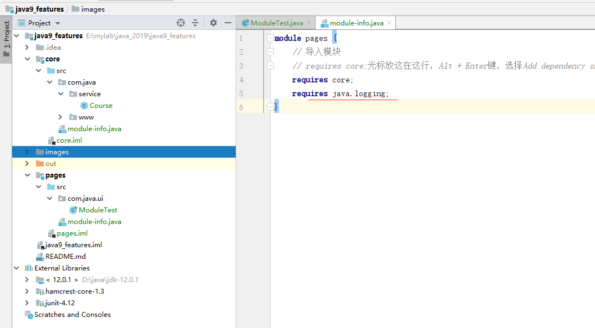  


### 导入jUnit模块


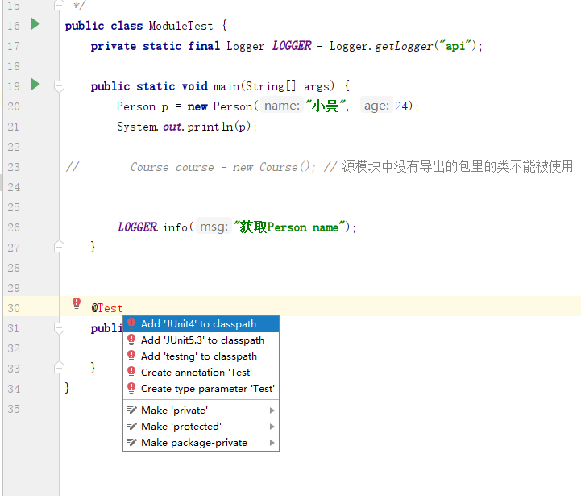  
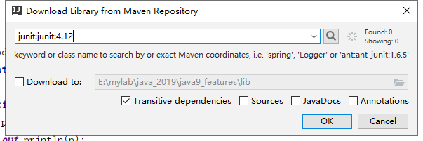  
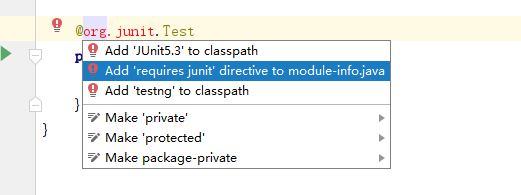  
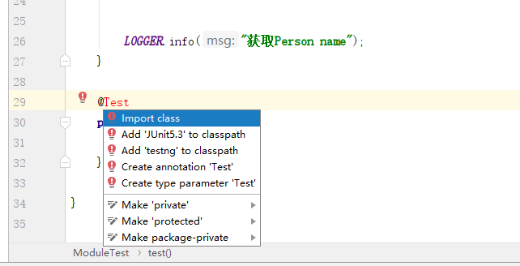  
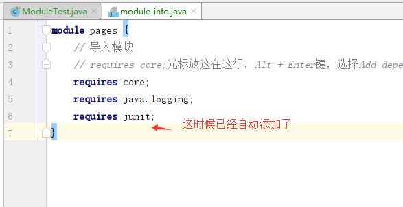  
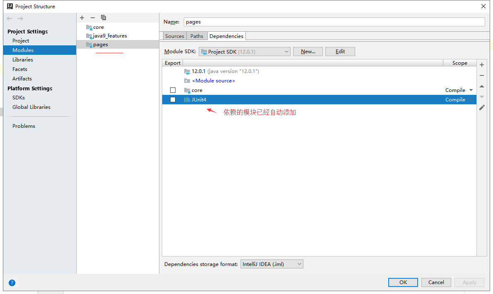  


## 4. REPL工具:jShell

jShell在命令行下就可以执行java命令和程序了

* tab自动补齐
* 自定添加分号

调出jShell, 在cmd窗口执行 jshell

```java
➜  ~ jshell
|  Welcome to JShell -- Version 11.0.8
|  For an introduction type: /help intro

jshell> /help intro
|  
|                                   intro
|                                   =====
|  
|  The jshell tool allows you to execute Java code, getting immediate results.
|  You can enter a Java definition (variable, method, class, etc), like:  int x = 8
|  or a Java expression, like:  x + x
|  or a Java statement or import.
|  These little chunks of Java code are called 'snippets'.
|  
|  There are also the jshell tool commands that allow you to understand and
|  control what you are doing, like:  /list
|  
|  For a list of commands: /help

jshell> System.out.println("ni hao");
ni hao

jshell> int i = 10;
i ==> 10

jshell> int j = 20;
j ==> 20

jshell> int k = i + j;
k ==> 30

jshell> System.
Logger                 LoggerFinder           arraycopy(             class                  clearProperty(         console()              
currentTimeMillis()    err                    exit(                  gc()                   getLogger(             getProperties()        
getProperty(           getSecurityManager()   getenv(                identityHashCode(      in                     inheritedChannel()     
lineSeparator()        load(                  loadLibrary(           mapLibraryName(        nanoTime()             out                    
runFinalization()      setErr(                setIn(                 setOut(                setProperties(         setProperty(           
setSecurityManager(    


jshell> System.out.println(k);
30

jshell> import java.util.*;

jshell> /imports
|    import java.io.*
|    import java.math.*
|    import java.net.*
|    import java.nio.file.*
|    import java.util.concurrent.*
|    import java.util.function.*
|    import java.util.prefs.*
|    import java.util.regex.*
|    import java.util.stream.*
|    import java.util.*

jshell> /var
|    int i = 10
|    int j = 20
|    int k = 30

jshell> public int add(int m, int n) {
   ...> return m + n;
   ...> }
|  created method add(int,int)

jshell> /method
|    int add(int,int)

jshell> /edit
```


## 5. 多版本兼容jar包

提供必要的类

```java
// 在指定目录(E:\teach\01_Java9\multijar\src\main\java\com\atguigu)下提供如下的类：

// Generator.java类
packagecom.atguigu;

import java.util.HashSet;
import java.util.Set;

public class Generator {
    // 构造器
    public Generator() {}

    // 方法
    public Set<String> createStrings() {
        Set<String> set = new HashSet<>();
        set.add("java");
        set.add("8");
        return set;
    }
}
```

```java
// 在如下目录(E:\teach\01_Java9\multijar\src\main\java-9\com\atguigu)下提供同名的类：

packagecom.atguigu;

import java.util.Set;

public class Generator {
    // 构造器
    public Generator() {}

    // 方法
    public Set<String> createStrings() {
        Set<String> set = Set.of("java", "9");
        return set;
    }
}
```

打包

```shell
javac -d build --release 8 src/main/java/com/atguigu/*.java
javac -d build9 --release 9 src/main/java-9/com/atguigu/*.java

jar --create --main-class=Application--filemultijar.jar -C build . --release 9 -C build9 .
```

在java9及之前版本的环境下进行测试即可


## 6. 接口的改进

可以声明私有方法

+ java 7 接口只能定义常量、抽象方法
+ java 8 接口中除了java 7特性外，还能定义default和static方法
+ java 9 接口中除了 java7、java8特性外，**还等定义private方法**


## 7. 钻石操作符升级
```java
    public void test2() {
        Set<String> set = new HashSet<>(){ // 创建一个继续于HashSet的匿名内部类
            { // 这对{}为静态代码块
                add("GG");
                add("JJ");
                add("MM");
                add("DD");
            }
        };

        set.forEach(System.out::println);
    }
```


## 8. 下划线变量使用限制
* 在 java 8 中及之前的版本，标识符(变量)可以独立使用"_"来命名

* 在 java 9 中规定"_"不能单独命名标识符了，如果使用会报错


## 9. String,StringBuffer,StringBuild存储结构变化

java 9开始，String,StringBuffer,StringBuild再也不用 char[] 来存储啦，**改成了byte[]加上编码标记，节约了一些空间**


## 10. 集合工厂方法创建只读集合

java9创建只读集合写法

```java
/* 
List.of()
Set.of()
Map.of()
Map.ofEntries()
*/

    public void test3() {
        List<Integer> list = List.of(11, 33, 55);
        list.forEach(System.out::println);
//        list.add(66); // 报java.lang.UnsupportedOperationException 异常

        Set<Integer> set = Set.of(33, 22, 55, 66);
//        set.add(66); // 不可修改

        // 创建只读Map方式1
        Map<String, Integer> map = Map.of("k1", 33, "k2", 55, "k3", 99);
        map.forEach((k, v) -> System.out.println(k + ": "+ v));
        map.put("k5", 77); // 不可修改

        // 创建只读Map方式2
        Map<String, Integer> map1 = Map.ofEntries(Map.entry("k1", 33), Map.entry("k2", 66));
        map1.put("k3", 88); // 不可修改
    }
```


## 11. 增强的Stream API

新增4个方法
* default Stream<T> takeWhile(Predicate<? super T> predicate)
>从此Stream对象由前往后去元素，当出现一个不符合predicate判断条件的停止取元素操作。

与  Stream<T> filter(Predicate<? super T> predicate) 是有区别的
* default Stream<T> dropWhile(Predicate<? super T> predicate)
 >从此Stream对象由前往后舍去元素，当出现一个不符合predicate判断条件的停止舍去元素操作  
 与takeWhile(Predicate predicate) 是互为反操作

* public static<T> Stream<T> ofNullable(T t)
>创建一个只能包含一个元素的Steam对象，如果该元素为null，则返回一个空的Stream对象

* public static<T> Stream<T> iterate(T seed, Predicate<? super T> hasNext, UnaryOperator<T> next)
>重载方法，创建无限流方法  
java 8方法：public static<T> Stream<T> iterate(final T seed, final UnaryOperator<T> f)

**java 8已经有此方法**
* public static<T> Stream<T> of(T t)
>当只添加一个元素时，则该元素不能为null,否则报NullPointerException异常

* public static<T> Stream<T> of(T... values)
>添加多个个元素时，允许元素为null，且允许出现多个null


## 12. 增强Optaional类

* 增加方法
```java
public Stream<T> stream()
//把Optional对象转成一个Stream流
```


## 13. 多分辨率图像API
需求背景：在 Mac 上，JDK 已经支持视网膜显示，但在 Linux 和 Windows 上并没有

* 新的 API 定义在 java.awt.image 包下
I将不同分辨率的图像封装到一张（多分辨率的）图像中，作为它的变体
* 获取这个图像的所有变体
* 获取特定分辨率的图像变体-表示一张已知分辨率单位为 DPI 的特
定尺寸大小的逻辑图像，并且这张图像是最佳的变体。
基于当前屏幕分辨率大小和运用的图像转换算法，
* java.awt.Graphics 类可以从接口 MultiResolutionImage 获取所需的变体。
* MultiResolutionImage 的基础实现是java.awt.image.BaseMultiResolutionImage。


## 14. 全新的Http客户端接口HttpClient


**HttpClient使用示例**
[HttpClientTest](./main/src/com/java/www/HttpClientTest.java)


## 15. 其他特性

* 智能Java编译工具

  智能 java 编译工具( sjavac )的第一个阶段始于 JEP139 这个项目，用于在多核处理器情况下提升 JDK 的编译速度。如今，这个项目已经
  进入第二阶段，即 JEP199，其目的是改进 Java 编译工具，并取代目前 JDK 编译工具 javac，继而成为 Java 环境默认的通用的智能编译工具。

  JDK 9 还更新了 javac 编译器以便能够将 java 9 代码编译运行在低版本 Java 中
* 统一的JVM日志系统

* javadoc的HTML 5支持

* Javascript引擎升级为Nashorn

* java的动态编译器

  JIT（Just-in-time）编译器可以在运行时将热点编译成本地代码，速度很快。但是 Java 项目现在变得很大很复杂，因此 JIT 编译器需
  要花费较长时间才能热身完，而且有些 Java 方法还没法编译，性能方面也会下降。AoT(Ahead-of-Time Compilation)编译就是为了解决这些问题而生的

