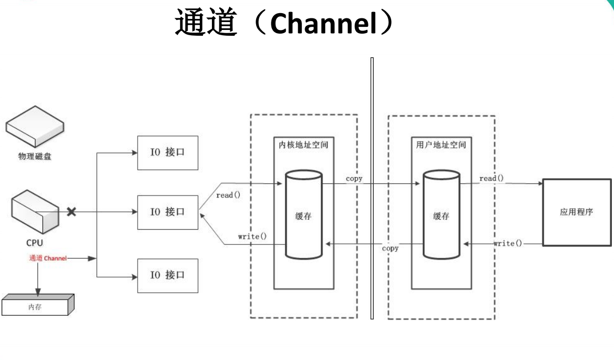
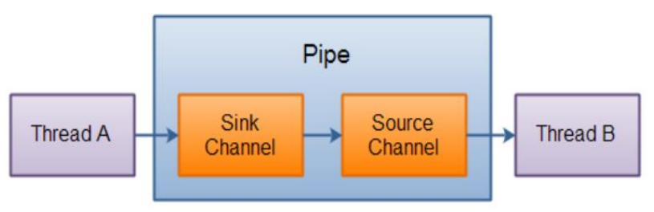

NIO
==


## 1. NIO概述
1.4开始加入, IO是面向流，**NIO是面向缓冲区，基于通道的IO操作。NIO效率更高。**

**主要概念是Buffer, Channel, Selector**


```java
java.nio.channels.Channel
    |--FileChannel  处理本地文件
    |--SocketChannel  TCP网络编程中客户端的Channel
    |--ServerSocketChannel  TCP网络编程中服务器的Channel
    |--DatagramChannel  UDP网络编程中发送端和接受端的Channel
    |--Pipe管道
        |--SinkChannel 
        |--SourceChannel
```


## 2. NIO与IO的区别

内容 |IO |NIO 
:--- |:--- |:---
面向的对象 |面向流 Stream Oriented |面向缓冲区 Buffer Oriented
IO是否阻塞 |阻塞IO(Blocking IO) |非阻塞IO(Non Blocking IO)
是否有选择器 |无 |选择器 Selector


## 3. Buffer

如果要通过NIO写数据到文件或者网络，或者是从文件和网络读取数据出来。此时需要通过Buffer缓冲区来进行


类型包括 ByteBuffer， CharBuffer， ShortBuffer， IntBuffer，LongBuffer， FloatBuffer， DoubleBuffer

### 基本属性


| 名字          | 属性 | 描述                                                         |
| ------------- | ---- | ------------------------------------------------------------ |
| **capacity**  | 容量 | 是缓冲区的容量大小，就是里面包含的数据的大小                 |
| **limit**     | 限制 | 对Buffer缓冲区使用的一个限制，说从这个index开始就不能读写数据了 |
| **position**  | 位置 | 数组中可以开始读写的index，不能大于limit                     |
| **remaining** | 剩余 | position到limit之间的距离                                    |
| **mark**      | 标记 | 在某个position的时候，设置一下mark，此时就可以设置一个标记，后续调用reset方法可以把position复位到当时设置的那个mark上去 |


### 常用方法

#### clean

还原缓冲区里的状态，position设置为0，limit设置为capacity，丢弃mark。但是**本质不是删除数据，就是还原那些标记位罢了，因为还原之后就可以复用缓冲区里的空间，覆盖老的数据了**

```java
public Buffer clear() {
    position = 0;
    limit = capacity;
    mark = -1;
    return this;
}
```

#### flip

准备读取刚写入的数据，就是将limit设置为当前position，将position设置为0，丢弃mark。**一般就是先写入数据，接着准备从0开始读这段数据，就可以用flip**

```java
public Buffer flip() {
    limit = position;
    position = 0;
    mark = -1;
    return this;
}
```

#### rewind

将position设置为0，并且丢弃mark。**一般先读取了一遍数据，接着想要再次重新读取一遍数据**，这个时候可以用rewind，此时limit是不变的

```java
// 倒回起点，取消标记，可重复读。
public Buffer rewind() {
    position = 0;
    mark = -1;
    return this;
}
```

#### others

```java
int capacity() //返回capacity容量值  
int limit() //返回此缓冲区当前的limit值
int position() //返回此缓冲区当前的position值
Buffer limit(int newLimit) //将缓冲区limit值设置为newLimit, 并返回一个此缓冲区
Buffer position(int newPosition)  //将缓冲区position值设置为newPosition, 并返回一个此缓冲区
boolean hasRemaining()  //从目前的position到limit是否有元素, true:有， false:无
int remaining()  //从目前的position到limit的元素个数
Buffer mark()  //记录当前的position位置，即mark = position
Buffer reset()  //position恢复到mark记录的位置，可用于再重读等需求。当 mark >= 0，则position = mark
```


### 数据操作

获取 Buffer 中的数据

```JAVA
get() //读取单个字节
get(byte[] dst) //批量读取多个(dst长度)字节到 dst 数组中
get(int index) //读取指定索引位置的字节(不会移动 position)
```

放入数据到 Buffer 中

```java
put(byte b) //将给定单个字节写入缓冲区的当前位置
put(byte[] src) //将 src 中的字节写入缓冲区的当前位置
put(int index, byte b) //将指定字节写入缓冲区的索引位置(不会移动 position)
```


### HeapByteBuffer

**在jvm堆**上面的一个buffer，底层的本质是**数组**，用类封装维护了属性，make/limit/position/capacity 

**优点**：由于内容维护在jvm里，所以把内容写进buffer里速度会快些；可以更容易回收

**创建方式**：Buffer.allocate(int capacity)


### DirectByteBuffer


**底层的数据其实是维护在操作系统的内存中，而不是jvm里**，DirectByteBuffer里维护了一个引用address指向了数据，从而操作数据

**优点**: 跟外设打交道时会快很多，因为**外设读取jvm堆里的数据时，先读取到内存， 再读取到jvm的buffer里面**，**如果使用DirectByteBuffer，则可以省去这一步，实现zero copy**

**创建方式**：ByteBuffer.allocateDirect(int capacity)

外设之所以要把jvm堆里的数据copy出来再操作，不是因为操作系统不能直接操作jvm内存，而是因为jvm在进行gc时，会对数据进行移动，一旦出现这种问题，外设就会出现数据错乱的情况


## 4. Channel通道

Channel 表示 IO 源与目标打开的连接。**Channel 本身不能直接访问数据，Channel 只能与Buffer 进行交互。** **Channel 是线程安全的。**

  

### 写入文件

```java
public class FileChannelDemo1 {

	public static void main(String[] args) throws Exception {
		// 构造一个传统的文件输出流
		FileOutputStream out = new FileOutputStream(
				"./hello.txt");
		// 通过文件输出流获取到对应的FileChannel，以NIO的方式来写文件
		FileChannel channel = out.getChannel();
	
		ByteBuffer buffer = ByteBuffer.wrap("hello world".getBytes());
		channel.write(buffer); 
    // hello world，在hello和world中间的那个空格的地方，再写入一条数据，比如hello hello world world
		// 把一段数据插入到磁盘文件的中间，磁盘随机写
		// 在文件的随机的位置写入数据
		buffer.rewind();
		channel.write(buffer);
		channel.close();
		out.close();
	}
}	
```


### 读取文件

```java
public class FileChannelDemo3 {
	
	public static void main(String[] args) throws Exception {
		FileInputStream in = new FileInputStream("./hello.txt");
		FileChannel channel = in.getChannel();
	
		ByteBuffer buffer = ByteBuffer.allocateDirect(16);
		channel.read(buffer); // 读数据写入buffer，所以写完以后，buffer的position = 16
		
		buffer.flip(); // position = 0，limit = 16
		byte[] data = new byte[16];
		buffer.get(data);
		channel.close();
		in.close();
	}
}
```


### 常用方法

```JAVA
int read(ByteBuffer dst) //从 Channel 中读取数据到 ByteBuffer
long read(ByteBuffer[] dsts) //将 Channel 中的数据“分散”到 ByteBuffer[]
int write(ByteBuffer src) //将 ByteBuffer 中的数据写入到 Channel
long write(ByteBuffer[] srcs) //将 ByteBuffer[] 中的数据“聚集”到 Channel
long position() //返回此通道的文件位置
FileChannel position(long p) //设置此通道的文件位置
long size() //返回此通道的文件的当前大小
FileChannel truncate(long s) //将此通道的文件截取为给定大小
void force(boolean metaData) //强制将所有对此通道的文件更新写入到存储设备中
```


### 文件锁

FileChannel给我们提供了一个功能，就是所谓的文件锁，你可以对文件上锁，共享锁，独占锁

+ 如果对文件是上共享锁的话，此时你可以读文件，别人也可以读文件，别人也可以上共享锁
+ 如果上了独占锁，别人就不可以上独占锁了，也不能上共享锁


### OsCache


通过FileChannel写数据到磁盘文件的时候，数据其实是停留在os cache上的，操作系统自己管理的一个内存区域，是一个读写的内存缓冲区，**可以提高读写性能**。**如果说此时机器宕机，那么os cache里的数据可能就会丢失了，内存里面**


## 5. NIO vs Blocking IO

### Blocking IO

**当一个线程调用 read() 或 write() 时，该线程被阻塞，直到有一些数据被读取或写入，该线程在此期间不能执行其他任务。**因此，在完成网络通信进行 IO 操作时，由于线程会阻塞，所以**服务器端必须为每个客户端都提供一个独立的线程进行处理**，当服务器端需要处理大量客户端时，**性能急剧下降。**一台普通的4核8G的服务器，虚拟机，100个工作线程，极限了，CPU负载就会很高了

    

### NIO

**当线程从某通道进行读写数据时，若没有数据可用时，该线程可以进行其他任务。线程通常将非阻塞 IO 的空闲时间用于在其他通道上执行 IO 操作，所以单独的线程可以管理多个输入和输出通道**。因此，NIO 可以让服务器端使用一个或有限几个线程来同时处理连接到服务器端的所有客户端

**用一个Selector来多路复用监听N多个Channel是否有请求，这里是基于操作系统底层的select通知机制的**，不是轮询各个channel，这样可以避免创建大量的线程


### Selector

**Selector多路复用器，Selector 可以同时监控多个 SelectableChannel 的 IO 状况**，也就是说，利用 Selector 可使一个单独的线程管理多个 Channel

**当调用 register(Selector sel, int ops) 将通道注册选择器**时，选择器对通道的监听事件，需要通过参数 ops 指定。

可以监听的事件类型（可使用 SelectionKey 的四个常量表示
* 读 : SelectionKey.OP_READ （1 << 0, 即1） 
* 写 : SelectionKey.OP_WRITE （1<<2, 即4）
* 连接 : SelectionKey.OP_CONNECT （1<<3, 即8）
* 接收 : SelectionKey.OP_ACCEPT （1<<4, 即16）

若注册时不止监听一个事件，则可以使用“位或”操作符连接

```JAVA
Set<SelectionKey> keys() //所有的 SelectionKey 集合。代表注册在该Selector上的Channel
selectedKeys() //被选择的 SelectionKey 集合。返回此Selector的已选择键集
int select() //监控所有注册的Channel，当它们中间有需要处理的 IO 操作时，该方法返回，并将对应得的 SelectionKey 加入被选择的SelectionKey 集合中，该方法返回这些 Channel 的数量。
int select(long timeout) //可以设置超时时长的 select() 操作
int selectNow() //执行一个立即返回的 select() 操作，该方法不会阻塞线程
Selector wakeup() //使一个还未返回的 select() 方法立即返回
void close() //关闭该选择器
```


### SelectionKey

**表示 SelectableChannel 和 Selector 之间的注册关系**。每次向选择器注册通道时就会**选择一个事件**。选择键包含两个表示为整数值的操作集。操作集的每一位都表示该键的通道所支持的一类可选择操作。

```JAVA
int interestOps() //获取感兴趣事件集合
int readyOps() //获取通道已经准备就绪的操作的集合
SelectableChannel channel() //获取注册通道
Selector selector() //返回选择器
boolean isReadable() //检测 Channal 中读事件是否就绪
boolean isWritable() //检测 Channal 中写事件是否就绪
boolean isConnectable() //检测 Channel 中连接是否就绪
boolean isAcceptable() //检测 Channel 中接收是否就绪
```


### Channel

#### SocketChannel

Java NIO中的SocketChannel是一个连接到TCP网络套接字的通道

+ 打开 SocketChannel
+ 读写数据
+ 关闭 SocketChannel

#### ServerSocketChannel

NIO中的 ServerSocketChannel 是一个可以监听新进来的TCP连接的通道，就像标准IO中 的ServerSocket一样

#### DatagramChannel

Java NIO中的DatagramChannel是一个能收发UDP包的通道

* 打开 DatagramChannel
* 接收/发送数据
* 关闭通道


## 6. 字符集

Charset 字符集
编码：字符数组 -> 字节数组
解码：字节数组 -> 字符数组

返回指定字符集名的字符集

 ```java
//返回指定字符集名的字符集
Charset charset = Charset.forName("GBK");
//获取编码器
CharsetEncoder encoder = charset.newEncoder();
encoder.encode()
//获取解码器
CharsetDecoder decoder = charset.newDecoder();
decoder.decode()
 ```


## 7. Pipe管道

Java NIO 管道是2个线程之间的单向数据连接。Pipe有一个source通道和一个sink通道。数据会被写到sink通道，从source通道读取





## 8. NIO2 Path, Paths, Files

java.nio.file.Path 接口代表一个平台无关的平台路径，描述了目录结构中文件的位置

**只有一个私有的构造器**

```java
public static Path get(String first, String... more) // 根据给定的一个或多个字符串创建Path对象，最终是调用了Path.of(first, more)
public static Path get(URI uri) //解析根据给定的uri并创建Path对象，最终是调用了Path.of(uri)。只能解析file文件系统资源，无法解析URL资源
```
